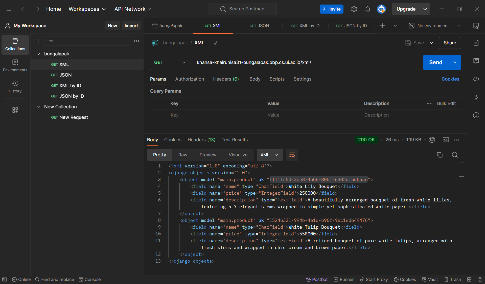
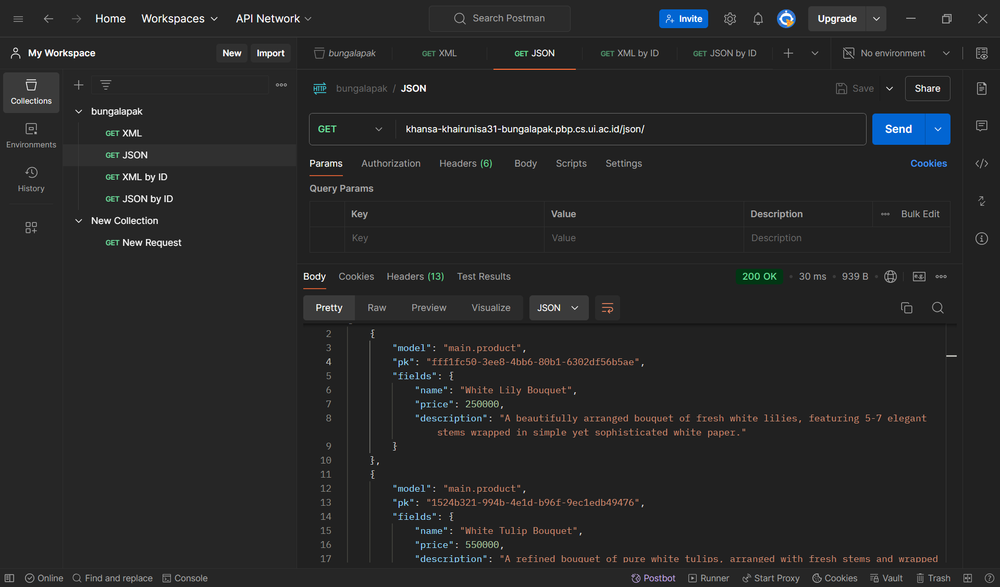
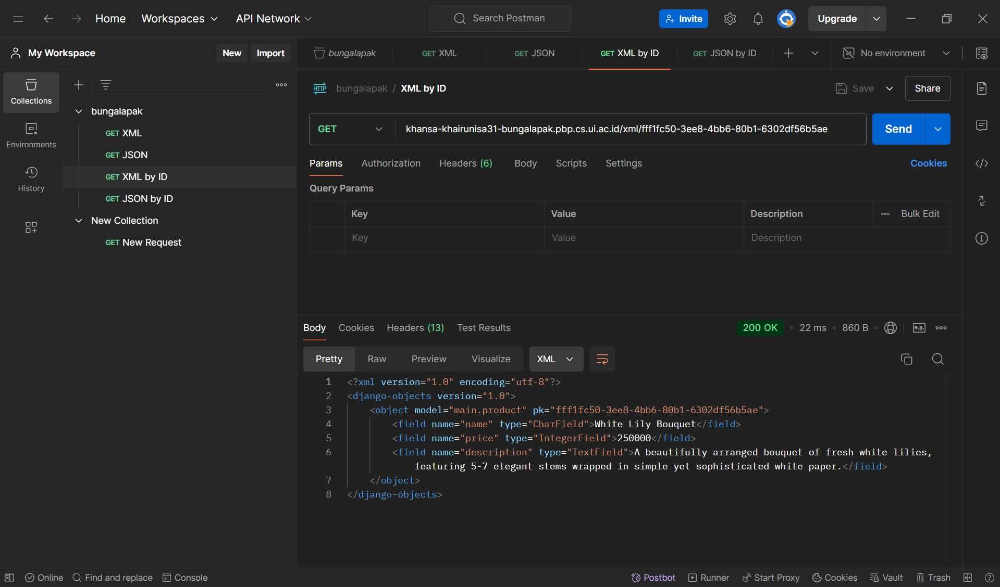
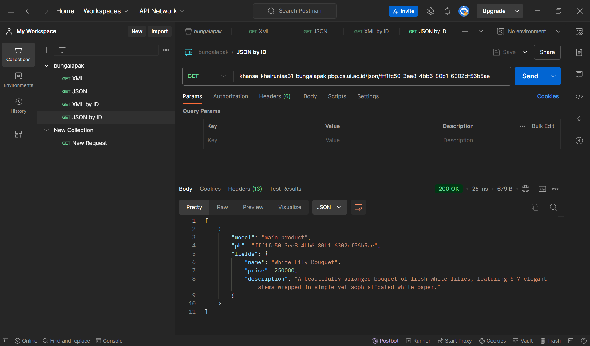
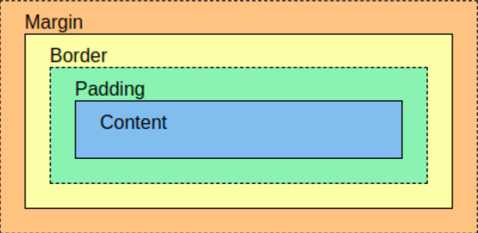

# Bungalapak
Proyek Django untuk tugas mata kuliah Pemrograman Berbasis Platform Ganjil 2024/2025. Dibuat oleh Khansa Khairunisa - 2306153462.

Tautan menuju PWS deployment dapat diakses [di sini](http://khansa-khairunisa31-bungalapak.pbp.cs.ui.ac.id/).

### Daftar Isi

- [Tugas 2 - Model-View-Template (MVT) pada Django](#tugas-2)
- [Tugas 3 - Form dan Data Delivery pada Django](#tugas-3)
- [Tugas 4 - Autentikasi, Session, dan Cookies pada Django](#tugas-4)
- [Tugas 5 - Desain Web menggunakan HTML, CSS dan Framework CSS](#tugas-5)
- [Tugas 6 - JavaScript dan AJAX](#tugas-6)

---

## Tugas 2 
Pada tugas ini, akan dilakukan implementasi dari konsep *Model-View-Template* (MVT) pada Django.

### Langkah Implementasi Checklist
Berikut adalah langkah-langkah yang saya lakukan untuk mengimplementasikan checklist dari Tugas 2.

<details>
<summary><b>Membuat proyek Django</b></summary>

1. Langkah pertama, saya membuat direktori baru dengan nama `bungalapak` dan masuk ke dalam direktori tersebut.
2. Setelah itu, saya membuat *virtual environment* dengan menjalankan perintah berikut di terminal.
    ```
    py -m venv env
    ```
3. Kemudian, mengaktifkannya dengan menggunakan perintah berikut.
    ```
    env\Scripts\activate
    ```
4. Di dalam direktori yang sama, saya membuat berkas `requirements.txt` menggunakan IDE Visual Studio Code dan menambahkan beberapa *dependencies* yang diperlukan sebagai berikut.
    ```
    django
    gunicorn
    whitenoise
    psycopg2-binary
    requests
    urllib3
    ```
5. Setelah itu, saya melakukan instalasi terhadap *dependencies* yang dibutuhkan dengan menjalankan perintah berikut.
    ```
    pip install -r requirements.txt
    ```
6. Untuk membuat proyek Django bernama `bungalapak`, saya menjalankan perintah berikut.
    ```
    django-admin startproject bungalapak .
    ```
7. Setelah itu, saya menambahkan string `"localhost"` dan `"127.0.0.1"` pada variabel `ALLOWED_HOSTS` di berkas `settings.py` untuk keperluan deployment.
8. Saya membuat *repository* GitHub baru bernama `bungalapak` dengan visibilitas *public*. 
9. Kemudian, saya menginisiasi direktori lokal `bungalapak` sebagai *repository* Git dengan menjalankan perintah berikut pada direktori `bungalapak`.
    ```
    git init
    ```
10. Di dalam direktori yang sama, saya membuat berkas `.gitignore` menggunakan IDE Visual Studio Code dan meng-copy-paste kode yang dibutuhkan dari tutorial.
11. Setelah itu, saya membuat *branch* utama baru bernama `master` dengan menjalankan perintah berikut.
    ```
    git branch -M master
    ```
12. Untuk menghubungkan direktori lokal dengan *repository* GitHub, saya menjalankan perintah berikut.
    ```
    git remote add origin https://github.com/khansakhai/bungalapak.git
    ```
13. Kemudian, saya melakukan `add`, `commit`, dan `push` dari direktori *repository* lokal dengan menggunakan perintah berikut.
    ```
    git add .
    git commit -m "UPDATE .gitignore"
    git push -u origin master
    ```
</details>

<details>
<summary><b>Membuat aplikasi dengan nama main</b></summary>

14. Untuk membuat aplikasi baru bernama `main` dalam proyek `bungalapak`, saya menjalankan perintah berikut.
    ```
    python manage.py startapp main
    ```
15. Kemudian, saya menambahkan nama aplikasi `'main'` pada variabel `INSTALLED_APPS` di berkas `settings.py`
</details>

<details>
<summary><b>Melakukan routing pada proyek</b></summary>

16. Agar proyek dapat menjalankan aplikasi `main`, route proyek perlu dikonfigurasi. Untuk itu, saya membuka berkas `urls.py` yang terdapat di dalam direktori proyek `bungalapak` dan melakukan beberapa perubahan kode sebagai berikut.
    ```python
    from django.urls import path, include

    urlpatterns = [
        ...
        path('', include('main.urls')),
        ...
    ]
    ```
    Saya mengimpor include agar berkas routing ini dapat mengimpor atau menyertakan route yang sudah didefinisikan oleh aplikasi lain ke dalam routing utama proyek, yaitu `urls.py` aplikasi `main`. Dengan menggunakan `path('', include('main.urls'))`, semua permintaan ke URL utama akan langsung dipetakan ke route yang didefinisikan dalam dalam berkas `urls.py` aplikasi `main`, sehingga pengguna tidak perlu menambahkan `/main` pada URL untuk mengakses halaman aplikasi `main`.
</details>

<details>
<summary><b>Membuat model pada aplikasi main</b></summary>

17. Untuk membuat model, saya memodifikasi berkas `models.py` pada direktori aplikasi `main` dengan model bernama `Product` yang memiliki atribut `name`, `price`, dan `description`. Berikut adalah kode yang saya tambahkan.
    ```python
    class Product(models.Model):
        name = models.CharField(max_length=255)
        price = models.IntegerField()
        description = models.TextField()
    ```
    Model ini memiliki atribut `name` yang berupa CharField dengan panjang maksimal 255, `price` yang berupa IntegerField, dan `description` yang berupa TextField. Ketiga atribut tersebut nantinya akan digunakan untuk mendefinisikan sebuah *item* yang ada pada aplikasi. 
18. Setelah itu, saya membuat migrasi model dan melakukan migrasi ke dalam basis data lokal dengan menjalankan perintah berikut.
    ```
    python manage.py makemigrations
    python manage.py migrate
    ```
    Dengan perintah tersebut, penambahan model sudah 'tertanam' pada aplikasi dan basis data sudah disesuaikan. 
</details>

<details>
<summary><b>Membuat fungsi pada views.py</b></summary>

19. Setelah mendefinisikan model, saya membuat direktori baru bernama `templates` di dalam direktori aplikasi `main` dan membuat berkas baru bernama `main.html` di dalam direktori `templates`. 
20. Kemudian, saya menambahkan berkas `main.html` dengan nama aplikasi, nama, dan kelas. Berikut adalah kode yang saya tambahkan.
    ```html
    <h1>{{ app_name }}</h1>

    <h5>Name: </h5>
    <p>{{ name }}</p>
    <h5>Class: </h5>
    <p>{{ class }}</p>
    ```
21. Setelah mendefinisikan template, kita perlu mengintegrasikannya dengan view. Untuk itu, pada  berkas `views.py` pada direktori aplikasi `main`, saya menambahkan fungsi `show_main` yang akan mengatur permintaan HTTP dan mengembalikan tampilan yang sesuai dengan template. Di dalamnya, saya menambahkan *dictionary* yang berisi data yang akan dikirimkan ke tampilan, mencakup nama aplikasi, nama, dan kelas. Berikut adalah kode yang saya tambahkan.
    ```python
    from django.shortcuts import render

    def show_main(request):
        context = {
            'app_name' : 'Bungalapak',
            'name' : 'Khansa Khairunisa',
            'class' : 'PBP C'
        }

        return render(request, "main.html", context)
    ```
    Pertama, saya mengimpor fungsi `render` dari modul `django.shortcuts` agar dapat melakukan render pada tampilan HTML menggunakan data yang ada. Kemudian, pada fungsi `show_main`, terdapat dictionary `context` yang berisi data yang ingin saya tampilkan pada aplikasi saya. Setelah itu, saya mengembalikan `render(request, "main.html", context)`, yang di mana fungsi `render()` ini akan me-render data pada `context` ke template `main.html` agar ditampilkan sebagai data yang dinamis. 
</details>

<details>
<summary><b>Membuat routing pada urls.py aplikasi main</b></summary>

22. Agar aplikasi `main` dapat dijalankan pada proyek, kita perlu melakukan konfigurasi pada aplikasi `main` itu sendiri. Untuk itu, saya membuat berkas `urls.py` di dalam direktori aplikasi `main` dan menambahkan berkas dengan kode berikut.
    ```python
    from django.urls import path
    from main.views import show_main

    app_name = 'main'

    urlpatterns = [
        path('', show_main, name='show_main'),
    ]
    ```
    Untuk mendefinisikan pola URL aplikasi `main`, kita menggunakan `path` dari `django.urls` dan memanggil `path('', show_main, name="show_main")` untuk mendefinisikan fungsi `show_main` dari `main.views` sebagai tampilan yang akan dimunculkan ketika URL aplikasi diakses.
</details>

<details>
<summary><b>Melakukan deployment ke PWS</b></summary>

23. Untuk melakukan deployment ke PWS, saya membuka website PWS dan membuat proyek baru bernama `bungalapak`. 
24. Kemudian, saya menambahkan URL deployment PWS pada variabel `ALLOWED_HOSTS` di berkas `settings.py`. 
25. Setelahnya, saya melakukan `add`, `commit`, dan `push` perubahan tersebut ke *repository* GitHub
26. Setelah melakukan push, saya menjalankan perintah yang terdapat pada informasi *Project Command* di halaman PWS. 
27. Kemudian, saya menjalankan perintah berikut.
    ```
    git branch -M master
    ```
28. Setelah menunggu beberapa menit, aplikasi saya sudah terdeploy dan dapat diakses melalui tautan deployment PWS.
</details>

### Bagan alur MVT

Proses dimulai ketika client atau browser mengirimkan permintaan HTTP ke ke server. Permintaan ini diarahkan ke URL routing yang didefinisikan dalam berkas `urls.py`. Berdasarkan URL yang diminta, Django akan mengarahkan permintaan ini ke fungsi atau kelas yang sesuai di berkas `views.py`. Fungsi view ini kemudian melakukan *query* ke basis data menggunakan model yang didefinisikan di berkas `models.py`, untuk mengakses atau memanipulasi data yang diperlukan. Data yang diperoleh selanjutnya diproses dan diteruskan ke template HTML, yang ditentukan dalam berkas template, seperti `main.html`. Template ini akan me-render data menjadi format HTML yang kemudian dikirimkan sebagai respons dari fungsi view kepada client, sehingga client dapat melihat halaman yang diminta. 

### Fungsi git dalam pengembangan perangkat lunak
Git merupakan sistem kontrol versi (Version Control System) yang berfungsi untuk melacak setiap perubahan pada kode dalam pengembangan perangkat lunak, memungkinkan pengembang untuk bekerja secara kolaboratif, mengelola proyek secara efisien, dan menghindari konflik. Setiap perubahan kode akan tersimpan di dalam *history* yang dapat diakses ataupun di-revert jika diperlukan. Selain itu, pengembang juga dapat bekerja dalam branch terpisah (branching) dan menggabungkan perubahan tersebut ke dalam kode utama (merging), sehingga setiap anggota tim dapat bekerja pada repositori yang sama secara bersamaan. 

### Mengapa Django dijadikan permulaan pembelajaran pengembangan perangkat lunak?
Django dijadikan permulaan pembelajaran pengembangan perangkat lunak terutama pada mata kuliah Pemrograman Berbasis Platform karena framework ini di tulis dalam bahasa Python, yang di mana sudah kami pelajari dari perkuliahan di semester satu. Selain itu, Django memiliki struktur yang lengkap, terorganisir, dan ramah bagi pemula. Django mengikuti pola *Model-View-Template* (MVT) yang memudahkan pengguna dalam memahami arsitektur aplikasi website. Django juga memiliki fitur atau modul lainnya, seperti autentikasi pengguna, pengelolaan URL, dan manajemen basis data (ORM).

### Mengapa model pada Django disebut sebagai ORM?
Model pada Django disebut sebagai *Object-Relational Mapping* (ORM) karena berfungsi untuk memetakan objek Python ke struktur basis data. Dengan ORM, tabel dalam basis data direpresentasikan sebagai kelas, dan kolom tabel sebagai atribut kelas. Ini memungkinkan pengembang untuk berinteraksi dengan basis data menggunakan pemrograman Python, tanpa perlu menulis SQL secara langsung, sehingga memudahkan pengelolaan data dan menjaga kode agar tetap konsisten dan mudah dipahami. 

## Tugas 3
Pada tugas ini, akan dilakukan implementasi dari Form dan Data Delivery pada Django.

### Langkah Implementasi Checklist
Berikut adalah langkah-langkah yang saya lakukan untuk mengimplementasikan checklist dari Tugas 3.

<details>
<summary><b>Membuat input form</b></summary>

1. Sebelum membuat form, saya membuat kerangka views dari situs web. Untuk itu, saya membuat direktori baru `templates` di direktori utama (root folder) dan membuat berkas baru bernama `base.html` di dalamnya. Saya mengisi berkas tersebut dengan kode berikut.
    ```html
    
    <!DOCTYPE html>
    <html lang="en">
        <head>
            <meta charset="UTF-8" />
            <meta name="viewport" content="width=device-width, initial-scale=1.0" />
             
        </head>

        <body>
             
        </body>
    </html>
    ```
    Berkas `base.html` ini merupakan suatu template dasar yang memiliki baris-baris yang dikurung dalam ``, di mana baris-baris inilah yang akan berfungsi untuk memuat data secara dinamis dari Django ke HTML. Sebagai contoh, template turunan akan me-*extend* template dasar, yaitu `base.html` dan mengganti konten di dalam block `` sesuai kebutuhan. 
2. Selanjutnya, kita perlu melakukan konfigurasi pada `settings.py` agar berkas `base.html` dapat terdeteksi sebagai template dasar. Berikut adalah baris kode yang saya tambahkan.
    ```python
    TEMPLATES = [
        {
            ...
            'DIRS': [BASE_DIR / 'templates'],
            ...
        },
    ]
    ```
    Setelah itu, `base.html` sudah dapat digunakan sebagai template dasar.
3. Kemudian, saya mengubah berkas `main.html` yang terdapat di dalam subdirektori `template` yang ada pada direktori `main` (`main/templates`) agar dapat menggunakan `base.html` sebagai template dasarnya. Berikut adalah perubahan kode yang saya lakukan.
    ```html
    
    

    <h1>{{ app_name }}</h1>

    <h5>Name: </h5>
    <p>{{ name }}</p>
    <h5>Class: </h5>
    <p>{{ class }}</p>
    
    ```
    Dengan perubahan tersebut, berkas `main.html` akan menggunakan `base.html` sebagai template utama.
4. Sebelum membuat form, saya mengubah primary key dari integer menjadi UUID terlebih dahulu, guna mengimplementasikan *best practice* dari sisi keamanan aplikasi. Untuk itu, saya melakukan perubahan pada berkas `models.py` yang terdapat di subdirektori `main/`. Berikut adalah kode yang saya tambahkan.
    ```python
    import uuid  # saya menambahkan baris ini di paling atas
    ...
    class Product(models.Model):
        id = models.UUIDField(primary_key=True, default=uuid.uuid4, editable=False)  # saya menambahkan baris ini
        name = models.CharField(max_length=255)
        price = models.IntegerField()
        description = models.TextField()
    ```
5. Karena saya melakukan perubahan pada `models.py`, maka saya harus melakukan migrasi model kembali untuk merefleksikan perubahan tersebut ke basis data. Migrasi dilakukan dengan menjalankan perintah berikut.
    ```
    python manage.py makemigrations
    python manage.py migrate
    ```
6. Untuk membuat form, kita perlu membuat berkas baru bernama `forms.py` di dalam direktori `main`. Form ini akan digunakan untuk membuat struktur form yang dapat menerima entry atau data item baru. Berikut adalah isi dari `forms.py` yang saya buat.
    ```py
    from django.forms import ModelForm
    from main.models import Product

    class ItemForm(ModelForm):
        class Meta:
            model = Product
            fields = ["name", "price", "description"]
    ```
    Karena nama model yang saya gunakan pada `models.py` adalah `Product`, maka saya perlu melakukan import `Product` pada awal kode. Kemudian, saya mendefinisikan class `ItemForm` sebagai form yang akan saya gunakan. Di dalam class `ItemForm` terdapat class `Meta` yang memiliki atribut `model` yang menunjukkan model yang akan saya gunakan untuk form, di mana data form akan disimpan menjadi sebuah objek `Product`, kemudian atribut `fields` yang menunjukkan *fields* yang akan diinput pada form.
7. Setelah itu, saya memodifikasi `views.py` agar dapat menampilkan form. Pertama, saya menambahkan beberapa import sebagai berikut. 
    ```python
    from django.shortcuts import render, redirect
    from main.forms import ItemForm
    from main.models import Product
    ```
    - `redirect` untuk melakukan redirect, yaitu mengarahkan pengguna ke halaman lain setelah melakukan submit pada form
    - `ItemForm` mengimpor form ke views agar dapat digunakan untuk menangani input data
    - `Product` mengimpor model dari basis data, sehingga views dapat mengakses data tersebut sesuai kebutuhan

    Kedua, saya menambahkan fungsi baru dengan nama `create_item` dan parameter `request` yang akan menghasilkan form yang dapat menambahkan data item baru secara otomatis ketika data di-submit dari form. Berikut adalah kode yang saya tambahkan.
    ```python
    def create_item(request):
        form = ItemForm(request.POST or None)

        if form.is_valid() and request.method == "POST":
            form.save()
            return redirect('main:show_main')
        
        context = {'form': form}
        return render(request, "create_item.html", context)
    ```
    Secara garis besar, fungsi ini akan menampilkan form dengan membuka halaman `create_item.html`. Apabila form di-submit (dengan request method POST) dan isinya valid, maka data yang diinput akan disimpan ke dalam basis data, kemudian website akan melakukan redirect ke fungsi `show_main`, yaitu halaman utama. 

    Ketiga, saya mengubah fungsi `show_main` menjadi seperti di bawah ini.
    ```python
    def show_main(request):
        items = Product.objects.all()

        context = {
            'app_name' : 'Bungalapak',
            'name' : 'Khansa Khairunisa',
            'class' : 'PBP C',
            'items' : items
        }

        return render(request, "main.html", context)
    ```
    Dengan `Product.objects.all()`, saya mengambil seluruh objek `Product` yang ada di dalam basis data, lalu menambahkannya ke dalam `context` sebagai value untuk ditampilkan di HTML. 
8. Setelah melakukan modifikasi pada `views.py`, saya melakukan modifikasi juga pada `urls.py` yang ada pada direktori `main`. Berikut adalah kode yang saya tambahkan. 
    ```python
    from main.views import show_main, create_item
    ...
    urlpatterns = [
        ...
        path('create-item', create_item, name='create_item'),
    ]
    ```
    Saya mengimport `create_item` dari `views.py`, serta menambahkan path untuk halaman form. 
9. Selanjutnya, saya membuat berkas HTML baru untuk halaman form yang bernama `create_item.html` pada direktori `main/templates`. Saya mengisi berkas tersebut dengan kode berikut.
    ```html
     
    
    <h1>Add New Item</h1>

    <form method="POST">
        
        <table>
            {{ form.as_table }}
            <tr>
                <td></td>
                <td>
                    <input type="submit" value="Add Item" />
                </td>
            </tr>
        </table>
    </form>

    
    ```
    Secara garis besar, berkas HTML ini menggunakan `base.html` sebagai template dasar (dengan extends), kemudian mendefinisikan content untuk mengisi block content yang sudah didefinisikan pula pada `base.html`. Berkas HTML membuat halaman form dengan menampilkan *fields* form yang sudah dibuat pada `forms.py` sebagai tabel. Terdapat pula `csrf_token` yang berfungsi sebagai *security*. 
10. Terakhir, pada berkas `main.html` yang terdapat pada direktori `main/templates`, saya menambahkan kode berikut di dalam `` dan di bawah elemen yang sudah ada sebelumnya. 
    ```html
    
    <p>Belum ada data item pada Bungalapak</p>
    
    <table>
        <tr>
            <th>Name</th>
            <th>Price</th>
            <th>Description</th>
        </tr>

        
        <tr>
            <th>{{item.name}}</th>
            <th>{{item.price}}</th>
            <th>{{item.description}}</th>
        </tr>
        
    </table>
    

    <br />

    <a href="">
        <button>Add New Item</button>
    </a>
    
    ```
    Secara garis besar, bagian HTML ini menampilkan item yang ada pada basis data dalam bentuk tabel dan menambahkan tombol pada bagian bawah untuk membuat item baru. Pada bagian atas, saya menambahkan sebuah if-statement yang memeriksa `items`. Apabila `items` kosong, maka tidak ada item yang ditampilkan. Namun, apabila `items` tidak kosong, halaman akan menampilkan data item dalam bentuk tabel. Kode ini juga menggunakan loop untuk melakukan iterasi dari setiap item yang ada dalam `items`. 
</details>

<details>
<summary><b>Menambahkan fungsi views untuk melihat objek dalam format XML, JSON, XML by ID, dan JSON by ID</b></summary>

11. Sebelum bisa menampilkan data dalam formal XML dan JSON, saya menambahkan beberapa *module* untuk di-import pada berkas `views.py` di dalam direktori `main`.
    ```python
    from django.http import HttpResponse
    from django.core import serializers
    ```
    - `HttpResponse` digunakan untuk mengirimkan respon HTTP ke client. Dalam kasus ini, kita gunakan untuk mengembalikan data dalam format XML dan JSON yang dihasilkan oleh serializers
    - `serializers` digunakan untuk men-translate objek model menjadi format lain. Dalam kasus, ini kita gunakan untuk men-translate objek menjadi XML dan JSON
12. Untuk menampilkan data dalam bentuk XML, saya menambahkan 2 fungsi baru pada `views.py` yang ada di dalam direktori `main`.
    ```python
    def show_xml(request):
        data = Product.objects.all()
        return HttpResponse(serializers.serialize("xml", data), content_type="application/xml")

    def show_xml_by_id(request, id):
        data = Product.objects.filter(pk=id)
        return HttpResponse(serializers.serialize("xml", data), content_type="application/xml")
    ```
    Fungsi yang pertama akan mengembalikan seluruh objek yang ada pada database dalam bentuk XML. Hal ini dilakukan dengan mengambil seluruh objek yang ada pada model, kemudian melakukan serializing terhadap data tersebut menjadi XML, dan dikembalikan sebagai respon HTTP. Tidak jauh berbeda dengan fungsi yang pertama, fungsi kedua mengambil objek yang di-filtering berdasarkan ID tertentu dan hanya objek dengan ID yang sesuai/sama yang akan diambil.
13. Untuk menampilkan data dalam bentuk JSON, saya menambahkan 2 fungsi baru pada `views.py` yang ada di dalam direktori `main`.
    ```python
    def show_json(request):
        data = Product.objects.all()
        return HttpResponse(serializers.serialize("json", data), content_type="application/json")

    def show_json_by_id(request, id):
        data = Product.objects.filter(pk=id)
        return HttpResponse(serializers.serialize("json", data), content_type="application/json")
    ```
    Kedua fungsi ini memiliki cara kerja yang sama persis dengan kedua fungsi XML sebelumnya, hanya saja objek di-serialize menjadi JSON. 
</details>

<details>
<summary><b>Membuat routing URL untuk masing-masing views</b></summary>

14. Untuk membuat routing URL, saya mengimpor fungsi-fungsi XML san JSON yang telah saya buat ke dalam berkas `urls.py` yang ada di direktori `main`.
    ```python
    from main.views import show_main, create_item, show_xml, show_json, show_xml_by_id, show_json_by_id
    ```
15. Kemudian, masih dalam berkas yang sama, saya menambahkan path URL untuk masing-masing fungsi yang saya import tadi, agar fungsi-fungsi tersebut dapat diakses. 
    ```python
    urlpatterns = [
        ...
        path('xml/', show_xml, name='show_xml'),
        path('json/', show_json, name='show_json'),
        path('xml/<str:id>/', show_xml_by_id, name='show_xml_by_id'),
        path('json/<str:id>/', show_json_by_id, name='show_json_by_id')
    ]
    ```
    Path yang pertama dan kedua adalah untuk menampilkan seluruh data dalam database dalam format XML atau JSON, yang menggunakan fungsi `show_xml` dan `show_json` pada `views.py`. Sedangkan, path yang ketiga dan keempat adalah untuk menampilkan data yang sesuai berdasarkan ID yang di-input pada path dalam format XML atau JSON menggunakan fungsi `show_xml_by_id` dan `show_json_by_id`. Misalnya, untuk melihat data dengan ID 1 dalam bentuk XML, kita dapat membuat URL `http://localhost:8000/xml/1/`, dan seterusnya. 
</details>

### Mengapa kita memerlukan data delivery dalam pengimplementasian sebuah platform?
Data delivery menjadi hal yang sangat penting dalam pengimplementasian platform dinamis untuk memungkinkan proses CRUD (Create, Read, Update, Delete) secara efisien antara client dan server. Dengan menggunakan format seperti XML, JSON, dan juga HTML, data dapat dikirim dan diterima dengan cepat dan tepat, sehingga komunikasi antara client dan platform akan menjadi lebih efisien dan mudah. Tanpa adanya data delivery yang efektif, pengalaman client akan terganggu oleh lambatnya waktu respons dan kesulitan dalam mengakses atau memperbarui informasi. 

### Mana yang lebih baik di antara XML dan JSON? Mengapa JSON lebih populer dibandingkan dengan XML?
JSON lebih populer di kalangan masyarakat karena sering kali dianggap lebih baik daripada XML. Hal ini disebabkan oleh beberapa kelebihan JSON dibandingkan dengan XML, di mana JSON memiliki sintaks yang lebih mudah dipahami, struktur yang lebih sederhana, dan lebih ringan. JSON juga lebih efisien dalam hal ukuran data dan kecepatan transmisi data, sementara XML memiliki struktur yang lebih kompleks sehingga menghasilkan file yang menggunakan banyak ruang. Melihat keunggulan JSON tersebut, saya pun merasa JSON lebih unggul jika dibandingkan dengan XML. Kepraktisan dan efisiensi JSON membuatnya lebih populer dan disukai oleh banyak orang. 

### Fungsi dari method `is_valid()` pada form Django dan alasan mengapa kita membutuhkan method tersebut
Method `is_valid()` pada form Django digunakan untuk memvalidasi data yang di-input oleh pengguna sebelum diproses lebih lanjut. Ketika method `is_valid()` dipanggil, Django akan memeriksa apakah data yang dikirimkan oleh pengguna sesuai dengan aturan validasi yang ditentukan dalam form. Kita membutuhkan method ini untuk memastikan bahwa data yang diterima adalah valid dan sesuai dengan kriteria yang sudah kita tetapkan dalam form, sehingga menghindari adanya kesalahan atau inkonsistensi data. 

### Mengapa kita membutuhkan `csrf_token` saat membuat form di Django? Apa yang dapat terjadi jika kita tidak menambahkan `csrf_token` pada form Django? Bagaimana hal tersebut dapat dimanfaatkan oleh penyerang?
Pada form Django, `csrf_token` digunakan untuk melindungi aplikasi web dari serangan CSRF (Cross-Site Request Forgery). Serangan CSRF terjadi ketika penyerang memanfaatkan sesi pengguna yang sudah terautentikasi untuk mengirimkan permintaan (*request*) yang tidak sah atau berbahaya ke server, seperti mengubah data, ataupun melakukan tindakan-tindakan lain yang tidak diinginkan atas nama pengguna tersebut. `csrf_token` memastikan bahwa setiap permintaan form yang dikirimkan benar-benar berasal dari pengguna karena token unik ini harus disertakan dalam setiap form dan dicocokkan oleh server. Tanpa adanya `csrf_token`, penyerang dapat menyisipkan form berbahaya pada situs web yang mereka kendalikan, yang secara otomatis mengirimkan permintaan kepada aplikasi web target. Jika permintaan tersebut tidak divalidasi dengan token, server akan menerima dan memprosesnya seolah-olah berasal dari pengguna yang sah, memungkinkan penyerang untuk melakukan perubahan atau tindakan yang tidak diinginkan tanpa sepengetahuan pengguna yang sebenarnya.

### Mengakses URL melalui Postman
#### - XML


#### - JSON


#### - XML by ID


#### - JSON by ID


## Tugas 4
Pada tugas ini, akan dilakukan implementasi dari Autentikasi, Session, dan Cookies pada Django.

### Langkah Implementasi Checklist
Berikut adalah langkah-langkah yang saya lakukan untuk mengimplementasikan checklist dari Tugas 4.

<details>
<summary><b>Mengimplementasikan fungsi registrasi, login, dan logout</b></summary>

1. Pertama, untuk membuat fungsi dan form registrasi, saya mengimpor dan menambahkan fungsi berikut di bekas `views.py` yang ada pada direktori `main`.
    ```python
    ...
    from django.contrib.auth.forms import UserCreationForm
    from django.contrib import messages
    ...
    def register(request):
    form = UserCreationForm()

    if request.method == "POST":
        form = UserCreationForm(request.POST)
        if form.is_valid():
            form.save()
            messages.success(request, 'Your account has been successfully created!')
            return redirect('main:login')
    context = {'form':form}
    return render(request, 'register.html', context)
    ```
    Fungsi ini akan membuat halaman form register. Apabila request method dari user adalah POST, form akan diperiksa validitasnya, kemudian, jika data yang diinput adalah valid, data akan disimpan ke database (disimpan sebagai user baru), dan akan redirect ke halaman login.
2. Kemudian, saya membuat berkas baru bernama `register.html` di dalam direktori `main/templates` sebagai halaman dari fitur register. Berkas tersebut saya isi dengan kode berikut.
    ```html
    

    
    <title>Register</title>
    

    

    <div class="login">
        <h1>Register</h1>

        <form method="POST">
            
            <table>
                {{ form.as_table }}
                <tr>
                    <td></td>
                    <td><input type="submit" name="submit" value="Daftar" /></td>
                </tr>
            </table>
        </form>

        
        <ul>
            
            <li>{{ message }}</li>
            
        </ul>
        
    </div>

    
    ```
    Kode di atas akan membuat halaman HTML untuk registrasi. Halaman ini melakukan *extends* dari `base.html` dan mendefinisikan blok konten untuk menampilkan form register. Tag `{{ form.as_table }}` digunakan untuk me-render form Django dalam format tabel secara otomatis, di mana setiap field form akan ditempatkan dalam baris dan kolom tabel. Form ini juga menampilkan pesan jika ada pesan error atau sukses setelah pengiriman form.
3. Untuk membuat fungsi login, saya mengimport beberapa module dan menambahkan fungsi `login_user` di dalam berkas `views.py` yang ada pada direktori `main`.
    ```python
    from django.contrib.auth.forms import UserCreationForm, AuthenticationForm
    from django.contrib.auth import authenticate, login
    ...
    def login_user(request):
        if request.method == 'POST':
            form = AuthenticationForm(data=request.POST)

            if form.is_valid():
                user = form.get_user()
                login(request, user)
                return redirect('main:show_main')

        else:
            form = AuthenticationForm(request)
        context = {'form': form}
        return render(request, 'login.html', context)
    ```
    Fungsi ini akan membuat halaman login. Apabila request method dari user adalah POST, form akan diperiksa validitasnya, kemudian, jika form valid, fungsi `form.get_user()` akan digunakan untuk mendapatkan objek user yang sesuai. Setelah itu, akan dilakukan login dengan menggunakan fungsi `login(request, user)`, dan setelahnya akan redirect ke halaman utama (main). Apabila request method dari user bukanlah POST (misal GET), maka Formulir login kosong `AuthenticationForm` dibuat tanpa data pengguna dan disimpan dalam variabel form. Kemudian, form tersebut dimasukkan ke dalam `context` dan di-render ke halaman `login.html`.
4. Untuk membuat fungsi logout, saya mengimport beberapa module dan menambahkan fungsi `logout_user` di dalam berkas `views.py` yang ada pada direktori `main`.
    ```python
    from django.contrib.auth import logout
    ...
    def logout_user(request):
        logout(request)
        return redirect('main:login')
    ```
    Fungsi ini akan memanggil fungsi logout dari Django untuk melakukan logout pada user. Setelah berhasil melakukan logout, user akan di-redirect ke halaman login. 

    Kemudian, pada `main.html` yang ada pada direktori `main/templates`, saya menambahkan tombol logout dengan kode berikut.
    ```html
    ...
    <a href="">
        <button>Logout</button>
    </a>
    
    ```
5. Setelah itu, saya mengimpor setiap fungsi yang sudah saya buat dan menambahkan path url nya ke berkas `urls.py` yang ada pada direktori `main`. Hal ini dilakukan agar fungsi tersebut dapat diakses.
    ```python
    ...
    from main.views import ..., register, login_user, logout_user
    ...
    urlpatterns = [
        ...,
        path('register/', register, name='register'),
        path('login/', login_user, name='login'),
        path('logout/', logout_user, name='logout')
    ]
    ```
6. Sekarang, halaman register, login, dan logout sudah dapat diakses dan sistem autentikasi sudah selesai. Setelahnya, saya menambahkan bagian kode ini pada berkas `views.py` untuk merestriksi akses user ke halaman utama, di mana user harus dalam keadaan logged in untuk dapat mengakses halaman utama. 
    ```python
    from django.contrib.auth.decorators import login_required
    ...
    @login_required(login_url='/login')
    def show_main(request):
        ...
    ```
    Apabila user belum terautentikasi dan mencoba untuk mengakses halaman utama, user akan di-redirect ke halaman login.
</details>

<details>
<summary><b>Menampilkan detail informasi pengguna yang sedang logged in dan menerapkan cookies</b></summary>

7. Pada berkas `views.py`, saya mengimpor beberapa module dan juga memodifikasi fungsi `login_user` pada blok `if form.is_valid()` menjadi sebagai berikut.
    ```python
    import datetime
    from django.http import HttpResponseRedirect
    from django.urls import reverse
    ...
    def login_user(request):
        ...
        if form.is_valid():
            user = form.get_user()
            login(request, user)
            response = HttpResponseRedirect(reverse("main:show_main"))
            response.set_cookie('last_login', str(datetime.datetime.now()))
            return response
    ...
    ```
    Pada bagian ini, apabila user berhasil melakukan login (akunnya sudah terautentikasi), akan ditambahkan cookie pada response dengan value berupa waktu kapan user terakhir kali login (`last_login`).
8. Kemudian, pada fungsi `show_main` di berkas yang sama, saya menambahkan potongan kode berikut ke dalam variable `context`.
    ```python
    context = {
        ...
        'last_login': request.COOKIES['last_login'],
    }
    ```
    Potongan kode ini berfungsi untuk menambahkan informasi cookie berupa `last_login` pada response yang akan ditampilkan di halaman web. 
9. Masih dalam berkas yang sama, saya memodifikasi fungsi `logout_user` menjadi sebagai berikut. 
    ```python
    def logout_user(request):
        logout(request)
        response = HttpResponseRedirect(reverse('main:login'))
        response.delete_cookie('last_login')
        return response
    ```
    Potongan kode ini berfungsi untuk menghapus cookie `last_login` dari response ketika user melakukan logout. 
10. Kemudian, pada halaman utama, yaitu pada berkas `main.html`, saya menambahkan potongan kode berikut di bawah tombol logout untuk menampilkan cookie `last_login`. 
    ```html
    ...
    <h5>Sesi terakhir login: {{ last_login }}</h5>
    ...
    ```
    Sekarang, cookie sudah dapat dilihat apabila user berhasil melakukan login. 
</details>

<details>
<summary><b>Membuat dua akun pengguna dengan masing-masing tiga dummy data di lokal</b></summary>

11. Saya membuat dua akun dengan username `adminbungalapak` dan `khansakhai`, serta menambahkan 3 data untuk setiap akunnya. 
</details>

<details>
<summary><b>Menghubungkan model Product dengan User</b></summary>

12. Untuk menghubungkan data dengan user, saya menambahkan kode berikut di dalam berkas `models.py` pada direktori `main`.
    ```python
    from django.contrib.auth.models import User
    ...
    class Product(models.Model):
        user = models.ForeignKey(User, on_delete=models.CASCADE)
        ...
    ```
    Pada kode tersebut, saya menambahkan field `user` pada setiap model menggunakan `ForeignKey` sebagai *relationship* untuk menghubungkan atau meng-assign setiap objek dari model ke user yang membuat objeknya. Jadi, satu produk dengan satu user akan dihubungkan karena sebuah produk pasti terasosiasikan dengan seorang user. 
13. Kemudian, pada berkas `views.py` yang ada pada direktori `main`, saya memodifikasi fungsi `create_item` menjadi sebagai berikut. 
    ```python
    def create_item(request):
        form = ItemForm(request.POST or None)

        if form.is_valid() and request.method == "POST":
            item = form.save(commit=False)
            item.user = request.user
            item.save()
            return redirect('main:show_main')
        
        context = {'form': form}
        return render(request, "create_item.html", context)
    ```
    Pada bagian ini, setiap `item` yang dibuat akan disimpan terlebih dahulu ke suatu variable tanpa langsung `commit` atau langsung disimpan ke database. Hal tersebut memungkinkan kita untuk memodifikasi terlebih dahulu objek tersebut sebelum disimpan ke database. Pada variable tersebut, field `user` akan di-assign dengan `user` yang melakukan POST request (melalui `request.user`), yang menandakan bahwa objek tersebut dimiliki oleh user yang sedang login. Setelah itu, barulah item akan disimpan ke dalam database. 
14. Pada berkas yang sama, saya memodifikasi fungsi `show_main`, yaitu value pada `items` dan `context` menjadi seperti berikut.
    ```python
    def show_main(request):
        items = Product.objects.filter(user=request.user)

        context = {
            'app_name' : 'Bungalapak',
            'name' : request.user.username,
            ...
        }
    ```
    Melalui kode ini, objek `Product` yang akan ditampilkan pada user yang terautentikasi hanyalah objek yang dimiliki oleh user tersebut. Hal ini dilakukan dengan menyaring seluruh objek `Product` berdasarkan field `user` yang disesuaikan dengan user pada request (user yang sedang login). Value dari field `name` pada `request` juga saya ubah menjadi nama user yang sedang terautentikasi pada request. 
15. Setelah melakukan perubahan ini, saya melakukan migrasi dengan menjalankan perintah berikut. 
    ```
    python manage.py makemigrations
    ```
    Sama seperti di tutorial, akan muncul sebuah error yang meminta default value, yang kemudian saya pilih `1` untuk menetapkan default value untuk field user pada semua row yang telah dibuat pada database. Saya juga mengetik `1` lagi untuk menetapkan user dengan ID `1` pada model yang sudah ada. Kemudian saya menjalankan perintah berikut untuk mengaplikasikan migrasi yang saya lakukan tadi.
    ```
    python manage.py migrate
    ```
16. Terakhir, saya mengimpor module baru dan mengganti variable `DEBUG` dari berkas `settings.py` yang ada pada subdirektori `bungalapak` menjadi seperti berikut. 
    ```python
    import os
    ...
    PRODUCTION = os.getenv("PRODUCTION", False)
    DEBUG = not PRODUCTION
    ...
    ```
    Setelah ini, fitur autentikasi, session, dan cookies sudah dapat digunakan. 
</details>

### Perbedaan antara HttpResponseRedirect() dan redirect()
- `HttpResponseRedirect()` merupakan class bawaan Django yang digunakan untuk melakukan pengalihan (redirect) ke URL tertentu dengan mengembalikan status HTTP 302. Kode status 302 ini menandakan pengalihan sementara (temporary redirect), yang berarti browser akan diarahkan ke URL tujuan, tetapi URL aslinya tidak dianggap berubah secara permanen. Berikut adalah contoh penggunaannya:
    ```python
    from django.http import HttpResponseRedirect
    
    def my_view(request):
        return HttpResponseRedirect('/some-url/')
    ```

- `redirect()` merupakan fungsi helper bawaan Django yang digunakan untuk mengalihkan pengguna ke URL tertentu. Fungsi ini mengembalikan objek respons HTTP yang berfungsi sama seperti `HttpResponseRedirect()`, tetapi dengan cara yang lebih mudah dan fleksibel. Fungsi ini dapat menerima parameter berupa URL langsung, nama view, atau objek model, dan secara otomatis mengubahnya menjadi sebuah URL yang sesuai. Berikut adalah contoh penggunaannya: 
    ```python
    from django.shortcuts import redirect

    def my_view(request):
        return redirect('some_view_name')
    ```

<b>Kesimpulan</b>

`HttpResponseRedirect()` dan `redirect()` memiliki fungsi yang sama, yaitu redirect atau mengalihkan pengguna ke URL tertentu, tetapi `HttpResponseRedirect()` memerlukan URL secara eksplisit, sedangkan `redirect()` lebih fleksibel karena dapat menerima URL, nama view, atau objek model, sehingga lebih mudah untuk digunakan dan meminimalisir kesalahan penulisan. 

### Cara kerja penghubungan model Product dengan User
Penghubungan model `Product` dengan `User` dilakukan dengan menambahkan field `user` di dalam model `Product` menggunakan `ForeignKey`. `ForeignKey` menghubungkan setiap objek `Product` dengan satu user yang membuatnya, sehingga setiap produk pasti terasosiasi oleh user tertentu.

<b>Contoh Model Product</b>

```python
from django.db import models
from django.contrib.auth.models import User

class Product(models.Model):
    user = models.ForeignKey(User, on_delete=models.CASCADE)
    name = models.CharField(max_length=255)
    price = models.IntegerField()
    description = models.TextField()
```
`ForeignKey(User)` menunjukkan bahwa field `user` menghubungkan model `Product` dengan model `User`, sehingga setiap produk yang dibuat akan dihubungkan dengan user tertentu (user pembuatnya). `on_delete=models.CASCADE` memastikan bahwa ketika user dihapus, maka semua produk yang dimiliki user tersebut juga akan dihapus. 

### Apa perbedaan antara *authentication* dan *authorization*, apakah yang dilakukan saat pengguna login? Jelaskan bagaimana Django mengimplementasikan kedua konsep tersebut.
*Authentication* merupakan proses memverifikasi identitas pengguna yang mencoba untuk mengakses aplikasi Django (misalnya menggunakan username dan password), sedangkan *authorization* merupakan proses menentukan konten apa saja yang dapat diakses oleh seorang pengguna yang sudah terautentikasi, sesuai dengan hak akses yang dimilikinya (misalnya perbedaan fitur antara admin dan pengguna). Saat pengguna login, dilakukan proses *authentication* untuk memverifikasi bahwa informasi yang dimasukkan (username dan password) sesuai dengan data yang ada di database. Setelah proses *authentication* berhasil, dilakukan proses *authorization* yang akan menentukan hak akses pengguna tersebut berdasarkan peran atau izin yang telah ditetapkan. Django mengimplementasikan *authentication* melalui sistem autentikasi bawaan yang menyediakan model pengguna dan fungsi untuk login dan logout, seperti `authenticate()` dan `login()`. Untuk *authorization*, Django menggunakan sistem izin (permissions) dan grup (user group), yang memungkinkan pengembang aplikasi untuk mengatur hak akses pengguna dengan menggunakan dekorator seperti `@permission_required` dan mendefinisikan izin pada model.

### Bagaimana Django mengingat pengguna yang telah login? Jelaskan kegunaan lain dari cookies dan apakah semua cookies aman digunakan?
Django mengingat pengguna yang telah login dengan menggunakan session. Ketika pengguna login, Django akan membuat session untuk pengguna tersebut, menyimpan session ID di server, dan mengirimkan session ID tersebut ke browser dalam bentuk cookies. Cookies inilah yang memungkinkan Django untuk mengenali pengguna saat mereka kembali ke aplikasi. Selain itu, cookies dapat digunakan untuk menyimpan preferensi pengguna, mempersonalisasi konten pengguna, dan melacak aktivitas pengguna. Meskipun memiliki berbagai kegunaan, tidak semua cookies aman digunakan. Cookies yang tidak dikelola dengan baik dapat rentan terhadap serangan, seperti Cross-Site Scripting (XSS) dan Cross-Site Request Forgery (CSRF). Oleh karena itu, untuk membuat cookies lebih aman, penting untuk menandai cookies sebagai HttpOnly untuk mencegah akses dari JavaScript, serta menggunakan atribut Secure untuk memastikan cookies hanya dikirim melalui koneksi HTTPS.

## Tugas 5
Pada tugas ini, akan dilakukan desain Web menggunakan HTML, CSS dan Framework CSS.

### Langkah Implementasi Checklist
Berikut adalah langkah-langkah yang saya lakukan untuk mengimplementasikan checklist dari Tugas 5.

<details>
<summary>Mengimplementasikan fungsi untuk menghapus dan mengedit product</summary>

1. Pertama, untuk membuat fitur edit item, saya mengimpor beberapa module dan membuat fungsi baru bernama `edit_item` di berkas `views.py` yang ada pada direktori `main`.
    ```python
    from django.shortcuts import .., reverse
    from django.http import .., HttpResponseRedirect
    ...
    def edit_item(request, id):
        # Get item berdasarkan id
        item = Product.objects.get(pk = id)

        # Set item sebagai instance dari form
        form = ItemForm(request.POST or None, instance=item)

        if form.is_valid() and request.method == "POST":
            # Simpan form dan kembali ke halaman awal
            form.save()
            return HttpResponseRedirect(reverse('main:show_main'))

        context = {'form': form}
        return render(request, "edit_item.html", context)
    ```
2. Kemudian, saya membuat berkas baru bernama `edit_item.html` pada direktori `main/templates`. Saya mengisi berkas tersebut dengan kode berikut.
    ```html
    

    

    
    

    <h1>Edit Item</h1>

    <form method="POST">
        
        <table>
            {{ form.as_table }}
            <tr>
                <td></td>
                <td>
                    <input type="submit" value="Edit Item"/>
                </td>
            </tr>
        </table>
    </form>

    
    ```
3. Pada berkas `urls.py` yang ada pada direktori `main`, saya import dan tambahkan path url pada pada `urlpatterns` dari fungsi `edit_item` yang sudah dibuat tadi.
    ```python
    from main.views import ..., edit_mood
    ...
    urlpatterns = [
        ...
        path('edit-item/<uuid:id>', edit_item, name='edit_item'),
    ]
    ...
    ```
4. Selanjutnya, untuk fitur hapus item, saya menambahkan fungsi `delete_item` pada berkas `views.py` yang ada pada direktori `main`. 
    ```python
    def delete_item(request, id):
    # Get item berdasarkan id
    item = Product.objects.get(pk = id)

    # Hapus item
    item.delete()

    # Kembali ke halaman awal
    return HttpResponseRedirect(reverse('main:show_main'))
    ```
5. Kemudian, pada berkas `urls.py`, saya mengimpor dan menambahkan path url pada `urlpatterns` dari fungsi `delete_item` yang sudah saya buat.
    ```python
    from main.views import ..., delete_mood
    ...
    urlpatterns = [
        ...
        path('delete/<uuid:id>', delete_item, name='delete_item'),
    ]
    ...
    ```
</details>

<details>
<summary>Mengimplementasikan button edit dan hapus untuk setiap card product</summary>

6. Untuk menambahkan button edit dan hapus product, saya memodifikasi berkas `main.html` dengan menambahkan kode berikut
    ```html
    <table>
        ...
        <tr>
            <td>
                <a href="">
                    <button>
                        Edit
                    </button>
                </a>
            </td>
            <td>
                <a href="">
                    <button>
                        Delete
                    </button>
                </a>
            </td>
        </tr>
        
    </table>
    ```
    Kode ini digunakan untuk membangun URL dengan menambahkan primary key (pk) dari objek item sebagai parameter. Parameter ini akan diteruskan ke fungsi view dari `edit_item` atau `delete_item`, yang membutuhkan nilai id untuk mengetahui item mana yang akan diedit atau dihapus. 
</details>

<details>
<summary>Membuat navigation bar (navbar)</summary>

7. Sebelum membuat navigation bar, saya menambahkan kode berikut di bagian head dari berkas `base.html` yang ada pada direktori `templates` untuk menyambungkan template django dengan tailwind.
    ```html
    ...
    <script src="https://cdn.tailwindcss.com"></script>
    ...
    ```
8. Untuk membuat navigation bar, saya membuat berkas baru bernama `navbar.html` pada folder `templates`. Saya mengisi berkas tersebut dengan kode untuk membuat navigation bar, dapat diakses pada link berikut: [navbar.html](templates/navbar.html)
9. Setelah itu, saya menghubungkan navigation bar tersebut ke dalam berkas `main.html`, `create_item.html`, dan `edit_item.html` yang berada pada `main/templates` dengan menggunakan tag `include`. Berikut adalah potongan kode yang saya tambahkan di setiap file tadi.
    ```html
    
    
    
    ...
    
    ```
10. Kemudian, saya memodifikasi berkas `settings.py` dengan potongan kode berikut.
    ```python
    ...
    MIDDLEWARE = [
        'django.middleware.security.SecurityMiddleware',
        'whitenoise.middleware.WhiteNoiseMiddleware', #Tambahkan tepat di bawah SecurityMiddleware
        ...
    ]
    ...
    STATIC_URL = '/static/'
    if DEBUG:
        STATICFILES_DIRS = [
            BASE_DIR / 'static' # merujuk ke /static root project pada mode development
        ]
    else:
        STATIC_ROOT = BASE_DIR / 'static' # merujuk ke /static root project pada mode production
    ...
    ```
    Dengan menambahkan `WhiteNoiseMiddleware` di `settings.py`, Django dapat mengelola file statis (seperti gambar, CSS, JS) tanpa perlu server eksternal. Saat `DEBUG=False`, `STATIC_ROOT` digunakan untuk menyimpan file statis yang siap digunakan di server produksi.
</details>

<details>
<summary>Kustomisasi halaman login, register, dan tambah product</summary>

11. Dalam melakukan kustomisasi, saya menggunakan HTML, CSS, dan Tailwind CSS. Karena kodenya terlalu panjang, saya sertakan link untuk mengakses setiap berkas di bawah ini.
- Berkas halaman login dapat diakses pada link berikut: [login.html](main/templates/login.html) 
- Berkas halaman register dapat diakses pada link berikut: [register.html](main/templates/register.html) 
- Berkas halaman tambah product dapat diakses pada link berikut: [create_item.html](main/templates/create_item.html) 

Halaman yang menggunakan `form.as_table` saya pecah tabelnya agar tiap bagiannya dapat saya styling dan saya jadikan komponen yang terpisah. Pada halaman login dan register, saya menambahkan pesan error atau persan sukses yang akan ditampilkan di bawah tombol submit, namun masih di dalam card besar. Kemudian, login dan register juga memiliki referensi ke url masing-masing, di mana pada halaman login terdapat link ke halaman register dan sebaliknya. 
</details>

<details>
<summary>Kustomisasi halaman daftar product</summary>

12. Untuk melakukan kustomisasi halaman daftar product, saya membuat berkas baru bernama `product_card.html` di dalam direktori `main/templates` dan memodifikasi berkas `main.html`. Pada setiap berkasnya, saya menambahkan kode untuk melakukan styling pada halaman daftar produk. Berikut adalah link menuju kedua berkas tersebut.
- Berkas halaman product dapat diakses pada link berikut: [product_card.html](main/templates/product_card.html) 
- Berkas halaman main dapat diakses pada link berikut: [main.html](main/templates/main.html) 

Saya membuat 1 card untuk setiap produk yang ada pada database, yang terdiri dari nama, harga, dan deskripsi. Pada bagian bawah card tersebut juga tersedia button untuk mengedit dan menghapus produk. Pada `main.html`, ketika sudah ada produk pada database, halaman akan menampilkan card-card dari setiap produk. Namun, jika belum ada produk di dalam database, halaman akan menampilkan foto sedih dan text yang menyatakan bahwa belum ada produk pada database.
</details>

### Jika terdapat beberapa CSS selector untuk suatu elemen HTML, jelaskan urutan prioritas pengambilan CSS selector tersebut!
Urutan prioritas CSS selector ditentukan oleh specificity (spesifisitas). CSS selector yang lebih spesifik akan diutamakan. Berikut adalah urutan prioritas dari beberapa jenis CSS selector dimulai dari selector yang paling diutamakan.
<br>
**1. Inline styles** : ditulis langsung di elemen HTML, contohnya `<div style="color: green;">`
<br>
**2. ID selector** : menggunakan ID sebagai selektor dan implementasinya diawali dengan tanda `#`, contohnya `#header {background-color: red;}`
<br>
**3. Class selector** : menggunakan Class sebagai selector dan implementasinya diawali dengan tanda `.`, contohnya `.content_section {background-color: #b66878;}`
<br>
**4. Element selector** : menggunakan elemen (seperti div, p) sebagai selector, contohnya `div { color: black; }`.
Jika terdapat konflik antara selector, selector yang lebih spesifik lah yang diprioritaskan. Jika spesifisitasnya sama, CSS yang ditulis terakhir yang akan digunakan.

### Mengapa responsive design menjadi konsep yang penting dalam pengembangan aplikasi web? Berikan contoh aplikasi yang sudah dan belum menerapkan responsive design!
Responsive design memungkinkan tampilan dan fungsi dari sebuah website atau aplikasi web menyesuaikan berbagai ukuran layar dan perangkat pengguna, seperti desktop, smartphone, dan tablet. Konsep ini penting karena pengguna mengakses website atau aplikasi web dengan berbagai perangkat yang tentunya memiliki ukuran layar yang berbeda-beda. Dengan diterapkannya responsive design, pengguna dapat lebih nyaman mengakses situs website dengan berbagai macam perangkat, hal ini tentu meningkatkan aksesibilitas, dan membuat website tersebut banyak dikunjungi oleh banyak orang. Selain itu, hal ini akan meningkatkan SEO dan peringkat Google karena Google mengutamakan situs yang mobile-friendly dalam peringkat pencarian mereka. 

<b>Contoh aplikasi yang sudah menerapkan responsive design</b>
- Google : tampilan Google secara otomatis menyesuaikan dengan perangkat yang digunakan
- Twitter : tampilan Twitter sudah disesuaikan dengan perangkat yang digunakan oleh user secara otomatis

<b>Contoh aplikasi yang belum menerapkan responsive design</b>
- SIAK NG : aplikasi ini memiliki tampilan yang sama walaupun diakses dengan perangkat yang berbeda

### Jelaskan perbedaan antara margin, border, dan padding, serta cara untuk mengimplementasikan ketiga hal tersebut!
- Margin : ruang di luar elemen, yang memisahkan elemen tersebut dengan elemen lainnya
- Border : garis yang mengelilingi elemen (garis pinggir), terletak di antara margin dan padding
- Padding : ruang di dalam elemen, terletak di antara border dan elemen konten

Untuk dapat melihat perbedaannya lebih mudah, kita dapat melihat box model berikut.


Berikut adalah contoh penggunaan ketiganya.
```css
.box {
    margin: 20px auto;            /* Jarak luar dari elemen box */
    padding: 30px;                /* Jarak di dalam box antara konten dan border */
    border: 5px solid #b66878;    /* Border 5px dengan warna pink */
}
```

### Jelaskan konsep flex box dan grid layout beserta kegunaannya!
#### Flexbox
Flexbox adalah metode layout CSS yang dirancang untuk mengatur elemen dalam 1 dimensi, baik secara horizontal maupun vertikal. Flexbox memudahkan pengaturan posisi elemen dalam suatu wadah (container) dengan cara yang fleksibel.

<b>Kegunaan Flexbox</b>
- Mengatur tata letak elemen secara fleksibel dalam satu baris atau kolom
- Memungkinkan elemen dapat menyesuaikan ukuran layar, baik diperbesar maupun diperkecil

<b>Contoh Penggunaan Flexbox</b>
```css
.container {
    display: flex;
    justify-content: center; /* Rata tengah secara horizontal */
    align-items: center;     /* Rata tengah secara vertikal */
    height: 100vh;
}
```

#### Grid Layout
Grid layout adalah metode layout CSS yang dirancang untuk mengatur elemen secara 2 dimensi, baik secara baris maupun kolom. Grid layout memungkinkan elemen memiliki tata letak yang lebih kompleks dengan grid berbentuk baris dan kolom.

<b>Kegunaan Grid Layout</b>
- Memungkinkan pembuatan tata letak yang lebih kompleks, yang terdiri dari baris dan kolom
- Mengatur elemen secara presisi di tempat tertentu dalam grid, baik berdasarkan baris maupun kolom

<b>Contoh Penggunaan Grid Layout</b>
```css
.container {
    display: grid;
    grid-template-columns: 1fr 1fr 1fr;  /* Membuat 3 kolom dengan ukuran sama */
    grid-gap: 20px;                      /* Jarak antar elemen grid */
}
```

## Tugas 6
Pada tugas ini, akan dilakukan implementasi dari JavaScript dan AJAX. 

### Langkah Implementasi Checklist
Berikut adalah langkah-langkah yang saya lakukan untuk mengimplementasikan checklist dari Tugas 6. 

<details>
<summary>Mengubah kode cards data product agar dapat mendukung AJAX GET</summary>

1. Untuk mengubah kode cards data product agar mendukung AJAX GET, saya menghapus code yang meng-generate cards data product kemudian menggantinya dengan fungsi refresh. Implementasinya ada pada langkah-langkah berikut ini. 
</details>

<details>
<summary>Melakukan pengambilan data product menggunakan AJAX GET</summary>

2. Untuk mengambil data item dengan AJAX GET, saya menghapus kode berikut pada fungsi `show_main` di berkas `views.py` dalam direktori `main`.
    ```python
    mood_entries = MoodEntry.objects.filter(user=request.user)
    ...
    'mood_entries': mood_entries,
    ```
3. Kemudian, saya mengubah baris pertama views untuk `show_json` dan `show_xml` seperti berikut.
    ```python
    data = MoodEntry.objects.filter(user=request.user)
    ```
4. Selanjutnya saya menghapus code yang meng-generate product cards di dalam berkas `main.html` berikut.
    ```html
    
    <div class="flex flex-col items-center justify-center min-h-[24rem] p-6">
        
        <p class="text-center text-gray-600 mt-4">Belum ada data item pada Bungalapak.</p>
    </div>
    
    <div class="grid grid-cols-1 sm:grid-cols-2 lg:grid-cols-3 gap-6 w-full" style="grid-auto-flow: dense;">
        
            
        
    </div>
     
    ```
5. Di tempat yang sama dengan block code yang dihapus, saya menambahkan potongan kode berikut.
    ```html
    <div id="item_cards"></div>
    ```
6. Saya membuat block `<script>` di bagian bawah berkas `main.html` pada direktori `main/templates` (sebelum ``) dan membuat fungsi baru di dalam block `<script>` tersebut dengan nama `getItems` dan `refreshItems`.
    ```javascript
    <script>
        async function getItems(){
            return fetch("").then((res) => res.json())
        }

        async function refreshItems() {
            document.getElementById("item_cards").innerHTML = "";
            document.getElementById("item_cards").className = "";
            const items = await getItems();
            let htmlString = "";
            let classNameString = "";
        
            if (items.length === 0) {
                classNameString = "flex flex-col items-center justify-center min-h-[24rem] p-6";
                htmlString = `
                    <div class="flex flex-col items-center justify-center min-h-[24rem] p-6">
                        
                        <p class="text-center text-gray-600 mt-4">Belum ada data item pada Bungalapak.</p>
                    </div>
                `;
            }
            else {
                classNameString = "columns-1 sm:columns-2 lg:columns-3 gap-6 space-y-6 w-full"
                items.forEach((item) => {
                    const name = DOMPurify.sanitize(item.fields.name);
                    const description = DOMPurify.sanitize(item.fields.description);
                    htmlString += `
                    <div class="relative break-inside-avoid bg-white shadow-lg rounded-lg p-6 mb-6 flex flex-col border-2 border-[#D49BA7] transform hover:scale-105 transition-transform duration-300">
                    <!-- Nama Produk -->
                    <div class="bg-[#DAABB5] text-gray-800 p-4 rounded-t-lg border-b-2 border-[#D49BA7] text-center">
                         <h3 class="font-bold text-2xl mb-2">${item.fields.item}</h3> 
                    </div>
                    
                    <!-- Isi Card -->
                    <div class="p-4 text-center">
                        <!-- Nama -->
                        <p class="font-semibold text-lg mb-2">Name</p>
                        <p class="text-gray-700 mb-2">
                            <span class="bg-[linear-gradient(to_bottom,transparent_0%,transparent_calc(100%_-_1px),#EFC3CA_calc(100%_-_1px))] bg-[length:100%_1.5rem] pb-1">${name}</span>
                        </p>
                        
                        <!-- Harga -->
                        <div class="mt-4">
                            <p class="text-gray-700 font-semibold mb-2">Price</p>
                            <span class="text-lg font-bold text-[#B66878] bg-white py-1 px-3 rounded-lg inline-block border border-[#D49BA7]">
                                Rp ${ item.fields.price }
                            </span>
                        </div>

                        <!-- Deskripsi Produk -->
                        <div class="mt-4">
                            <p class="text-gray-700 font-semibold mb-2">Description</p>
                            <p class="text-gray-600 italic bg-[#FCE4EC] p-3 rounded-lg border border-[#DAABB5]">
                                ${ description }
                            </p>
                        </div>
                    </div>

                    <!-- Tombol Edit dan Delete -->
                    <div class="flex justify-center space-x-4 mt-6">
                        <!-- Tombol Edit -->
                        <a href="/edit-item/${item.pk}" class="bg-[#FAA943] hover:bg-[#bf8133] text-white rounded-full p-3 transition duration-300 shadow-md">
                            <svg xmlns="http://www.w3.org/2000/svg" class="h-6 w-6" viewBox="0 0 20 20" fill="currentColor">
                                <path d="M13.586 3.586a2 2 0 112.828 2.828l-.793.793-2.828-2.828.793-.793zM11.379 5.793L3 14.172V17h2.828l8.38-8.379-2.83-2.828z" />
                            </svg>
                        </a>
                        <!-- Tombol Delete -->
                        <a href="/delete/${item.pk}" class="bg-red-700 hover:bg-red-900 text-white rounded-full p-3 transition duration-300 shadow-md">
                            <svg xmlns="http://www.w3.org/2000/svg" class="h-6 w-6" viewBox="0 0 20 20" fill="currentColor">
                                <path fill-rule="evenodd" d="M9 2a1 1 0 00-.894.553L7.382 4H4a1 1 0 000 2v10a2 2 0 002 2h8a2 2 0 002-2V6a1 1 0 100-2h-3.382l-.724-1.447A1 1 0 0011 2H9zM7 8a1 1 0 012 0v6a1 1 0 11-2 0V8zm5-1a1 1 0 00-1 1v6a1 1 0 102 0V8a1 1 0 00-1-1z" clip-rule="evenodd" />
                            </svg>
                        </a>
                    </div>
                </div>
                    `;
                });
            }
            document.getElementById("item_cards").className = classNameString;
            document.getElementById("item_cards").innerHTML = htmlString;
        }
        refreshItems();
    </script>
    ```
    Bagian code inilah yang nantinya akan meng-generate setiap product cards yang ada pada database user. Satu `htmlString` merupakan satu card, namun penambahannya card lainnya dilakukan dengan cara diiterasi berdasarkan item yang diambil dari fungsi `getItems()`. Fungsi `getItems()` melakukan fetch pada url JSON yag mengembalikan item milik user dalam format JSON.
</details>

<details>
<summary>Membuat tombol yang membuka sebuah modal dengan form untuk menambahkan mood</summary>

7. Untuk membuat tombol yang membuat modal dengan form, saya menambahkan kode berikut di bawah `div` dengan `id` `item_cards`.
    ```html
    <div id="crudModal" tabindex="-1" aria-hidden="true" class="hidden fixed inset-0 z-50 w-full flex items-center justify-center bg-gray-800 bg-opacity-50 overflow-x-hidden overflow-y-auto transition-opacity duration-300 ease-out">
        <div id="crudModalContent" class="relative bg-white rounded-lg shadow-lg w-5/6 sm:w-3/4 md:w-1/2 lg:w-1/3 mx-4 sm:mx-0 transform scale-95 opacity-0 transition-transform transition-opacity duration-300 ease-out">
            <!-- Modal header -->
            <div class="flex items-center justify-between p-4 border-b rounded-t">
                <h3 class="text-xl font-semibold text-gray-900">
                    Add New Item
                </h3>
                <button type="button" class="text-gray-400 bg-transparent hover:bg-gray-200 hover:text-gray-900 rounded-lg text-sm p-1.5 ml-auto inline-flex items-center" id="closeModalBtn">
                    <svg aria-hidden="true" class="w-5 h-5" fill="currentColor" viewBox="0 0 20 20" xmlns="http://www.w3.org/2000/svg">
                        <path fill-rule="evenodd" d="M4.293 4.293a1 1 0 011.414 0L10 8.586l4.293-4.293a1 1 0 111.414 1.414L11.414 10l4.293 4.293a1 1 0 01-1.414 1.414L10 11.414l-4.293 4.293a1 1 0 01-1.414-1.414L8.586 10 4.293 5.707a1 1 0 010-1.414z" clip-rule="evenodd"></path>
                    </svg>
                    <span class="sr-only">Close modal</span>
                </button>
            </div>
            <!-- Modal body -->
            <div class="px-6 py-4 space-y-6 form-style">
                <form id="itemForm">
                    <div class="mb-4">
                        <label for="name" class="block text-sm font-medium text-gray-700">Name</label>
                        <input type="text" id="name" name="name" class="mt-1 block w-full border border-gray-300 rounded-md p-2 hover:border-[#c98895]" placeholder="Enter your item" required>
                    </div>
                    <div class="mb-4">
                        <label for="price" class="block text-sm font-medium text-gray-700">Price</label>
                        <input type="number" id="price" name="price" class="mt-1 block w-full border border-gray-300 rounded-md p-2 hover:border-[#c98895]" placeholder="Enter item price" required>
                    </div>
                    <div class="mb-4">
                        <label for="description" class="block text-sm font-medium text-gray-700">Description</label>
                        <textarea id="description" name="description" rows="3" class="mt-1 block w-full h-52 resize-none border border-gray-300 rounded-md p-2 hover:border-[#c98895]" placeholder="Describe your item" required></textarea>
                    </div>
                </form>
            </div>
            <!-- Modal footer -->
                <div class="flex flex-col space-y-2 md:flex-row md:space-y-0 md:space-x-2 p-6 border-t border-gray-200 rounded-b justify-center md:justify-end">
                    <button type="button" class="bg-gray-500 hover:bg-gray-600 text-white font-bold py-2 px-4 rounded-lg" id="cancelButton">Cancel</button>
                    <button type="submit" id="submitItem" form="itemForm" class="bg-[#c98895] hover:bg-[#b66878] text-white font-bold py-2 px-4 rounded-lg">Save</button>
                </div>
        </div>
    </div>
    ```
8. Agar modal tersebut dapat berfungsi, saya menambahkan fungsi-fungsi JavaScript berikut di dalam block `<script>`.
    ```javascript
    const modal = document.getElementById('crudModal');
    const modalContent = document.getElementById('crudModalContent');

    function showModal() {
        const modal = document.getElementById('crudModal');
        const modalContent = document.getElementById('crudModalContent');

        modal.classList.remove('hidden'); 
        setTimeout(() => {
            modalContent.classList.remove('opacity-0', 'scale-95');
            modalContent.classList.add('opacity-100', 'scale-100');
        }, 50); 
    }

    function hideModal() {
        const modal = document.getElementById('crudModal');
        const modalContent = document.getElementById('crudModalContent');

        modalContent.classList.remove('opacity-100', 'scale-100');
        modalContent.classList.add('opacity-0', 'scale-95');

        setTimeout(() => {
            modal.classList.add('hidden');
        }, 150); 
    }

    document.getElementById("cancelButton").addEventListener("click", hideModal);
    document.getElementById("closeModalBtn").addEventListener("click", hideModal);
    ```
9. Kemudian, saya menambahkan tombol `Add New Item by AJAX` di bawah tombol `Add New Item` untuk melakukan penambahan data dengan AJAX.
    ```html
    <div class="flex flex-col items-center mb-6 mt-16 bg-[#f4d7db] py-8 w-full rounded-lg shadow-md">
        <button data-modal-target="crudModal" data-modal-toggle="crudModal" class="bg-[#d49ba7] hover:bg-[#b66878] text-white font-bold py-3 px-6 mt-4 rounded-lg transition duration-300 ease-in-out transform hover:-translate-y-1 hover:scale-105" onclick="showModal();">
            Add New Item by AJAX
        </button>
    </div>
    ```
</details>

<details>
<summary>Membuat fungsi view baru untuk menambahkan mood baru ke dalam basis data</summary>

10. Saya mengimpor beberapa module dan membuat fungsi baru bernama `add_item_ajax` pada berkas `views.py` yang ada pada direktori `main`.
    ```python
    @csrf_exempt
    @require_POST
    def add_item_ajax(request):
        name = strip_tags(request.POST.get("name"))
        price = request.POST.get("price")
        description = strip_tags(request.POST.get("description"))
        user = request.user

        new_item = Product(
            name=name, price=price,
            description=description,
            user=user
        )
        new_item.save()

        return HttpResponse(b"CREATED", status=201)
    ```
    Fungsi tersebut akan mengambil value dari tiap field dari form yang terdapat pada modal, kemudian membuat item baru dengan value-value tersebut dan menyimpannya ke dalam database.
</details>

<details>
<summary>Membuat path /create-ajax/ yang mengarah ke fungsi view yang baru dibuat</summary>

11. Pada berkas `urls.py` yang terdapat di direktori `main`, saya menambahkan routing untuk fungsi `add_item_ajax` dengan cara mengimpor fungsi tersebut dan menambahkan pathnya ke dalam `urlpatterns`.
    ```python
    from main.views import ..., add_item_ajax

    urlpatterns = [
        ...
        path('create-item-ajax', add_item_ajax, name='add_item_ajax'),
    ]
    ```
</details>

<details>
<summary>Menghubungkan form ke path /create-ajax/</summary>

12. Pada `main.html` saya menambahkan fungsi baru pada block `<script>` dengan nama `addItem`.
    ```javascript
    ...
    <script>
        function addItem() {
            fetch("", {
                method: "POST",
                body: new FormData(document.querySelector('#itemForm')),
            })
            .then(response => refreshItems())
        
            document.getElementById("itemForm").reset(); 
            document.querySelector("[data-modal-toggle='crudModal']").click();
        
            return false;
        }
    ...
    </script>
    ```    
    Fungsi ini menjalankan fetch dengan metode POST, di mana data dari form dalam modal diambil menggunakan `querySelector` berdasarkan ID dari tag form. Data tersebut kemudian diubah menjadi `FormData` dan dikirim sebagai body request. Setelah itu, fungsi `refreshProducts` dipanggil untuk memperbarui cards di halaman sesuai dengan data yang baru ditambahkan. Terakhir, isi form akan dikosongkan kembali.
</details>

<details>
<summary>Melakukan refresh pada halaman utama secara asinkronus</summary>

11. Hal ini sudah diimplementasikan, yaitu pada refreshProduct() yang terdapat pada `main.html`, serta sudah dipanggil setelah fungsi `fetch()` pada `addItem()` dijalankan.
</details>

### Manfaat dari penggunaan JavaScript dalam pengembangan aplikasi web
Dalam pengembangan aplikasi web, JavaScript memiliki manfaat utama untuk memungkinkan pembuatan halaman website yang interaktif dan responsif. Selain itu, dengan JavaScript, pengembang dapat memperbarui konten halaman secara dinamis tanpa perlu memuat ulang (*refresh*) seluruh halaman. JavaScript juga mendukung berbagai framework dan pustaka seperti React, Angular, dan Vue, yang mempercepat proses pengembangan dan mempermudah pemeliharaan aplikasi.

### Jelaskan fungsi dari penggunaan await ketika kita menggunakan fetch()! Apa yang akan terjadi jika kita tidak menggunakan await?
Fungsi penggunaan `await` ketika kita menggunakan `fetch()` adalah untuk menunggu sampai proses pengambilan data selesai sebelum melanjutkan kode berikutnya, sehingga kita bisa mendapatkan hasilnya secara langsung. Jika kita tidak menggunakan await, kode akan terus berjalan tanpa menunggu hasil `fetch()`, yang bisa menyebabkan data belum tersedia ketika kita membutuhkannya.

### Mengapa kita perlu menggunakan decorator csrf_exempt pada view yang akan digunakan untuk AJAX POST?
Decorator `csrf_exempt` digunakan pada view yang akan menerima permintaan AJAX POST untuk menonaktifkan pemeriksaan CSRF (Cross-Site Request Forgery) yang secara default dilakukan oleh Django. Dalam Django, semua permintaan POST membutuhkan token CSRF untuk melindungi aplikasi dari serangan CSRF, di mana penyerang bisa membuat permintaan yang terlihat seperti permintaan asli dari pengguna. Namun, dalam situasi tertentu seperti saat menggunakan AJAX POST, mungkin sulit atau tidak praktis untuk menyertakan token CSRF di setiap permintaan, terutama jika permintaan datang dari sumber yang sah tapi tidak memiliki token CSRF. Dengan menggunakan `csrf_exempt`, kita menonaktifkan pengecekan CSRF untuk view tersebut, memungkinkan permintaan AJAX POST tetap berjalan tanpa perlu token CSRF, walaupun ini sebaiknya digunakan dengan hati-hati karena dapat menurunkan tingkat keamanan aplikasi.

### Pada tutorial PBP minggu ini, pembersihan data input pengguna dilakukan di belakang (backend) juga. Mengapa hal tersebut tidak dilakukan di frontend saja?
Pembersihan data tidak bisa hanya dilakukan di frontend karena frontend mudah dimanipulasi. Pengguna atau penyerang dapat memodifikasi data yang dikirim ke server menggunakan alat eksternal, jadi jika pembersihan hanya dilakukan di frontend, server tetap rentan terhadap serangan seperti XSS. Dengan melakukan pembersihan di backend, kita memperketat keamanan untuk memastikan data yang disimpan benar-benar aman, walaupun data tersebut dikirim dari sumber yang tidak tepercaya atau dimanipulasi di luar kontrol frontend.