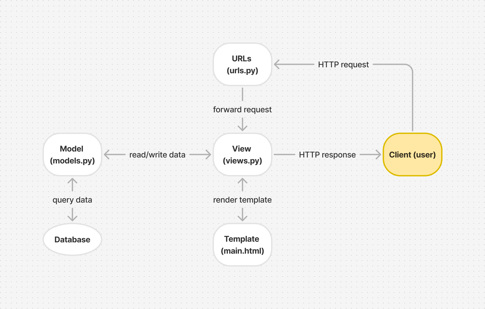

# Bungalapak
Proyek Django untuk tugas mata kuliah Pemrograman Berbasis Platform Ganjil 2024/2025. Dibuat oleh Khansa Khairunisa - 2306153462.

Tautan menuju PWS deployment dapat diakses [di sini](http://khansa-khairunisa31-bungalapak.pbp.cs.ui.ac.id/).

## Tugas 2 
Pada tugas ini, akan dilakukan implementasi dari konsep *Model-View-Template* (MVT) pada Django.

### Langkah Implementasi Checklist
Berikut adalah langkah-langkah yang saya lakukan untuk mengimplementasikan checklist dari Tugas 2.

#### Membuat proyek Django
1. Langkah pertama, saya membuat direktori baru dengan nama `bungalapak` dan masuk ke dalam direktori tersebut.
2. Setelah itu, saya membuat *virtual environment* dengan menjalankan perintah berikut di terminal.
    ```
    py -m venv env
    ```
3. Kemudian, mengaktifkannya dengan menggunakan perintah berikut.
    ```
    env\Scripts\activate
    ```
4. Di dalam direktori yang sama, saya membuat berkas `requirements.txt` menggunakan IDE Visual Studio Code dan menambahkan beberapa *dependencies* yang diperlukan sebagai berikut.
    ```
    django
    gunicorn
    whitenoise
    psycopg2-binary
    requests
    urllib3
    ```
5. Setelah itu, saya melakukan instalasi terhadap *dependencies* yang dibutuhkan dengan menjalankan perintah berikut.
    ```
    pip install -r requirements.txt
    ```
6. Untuk membuat proyek Django bernama `bungalapak`, saya menjalankan perintah berikut.
    ```
    django-admin startproject bungalapak .
    ```
7. Setelah itu, saya menambahkan string `"localhost"` dan `"127.0.0.1"` pada variabel `ALLOWED_HOSTS` di berkas `settings.py` untuk keperluan deployment.
8. Saya membuat *repository* GitHub baru bernama `bungalapak` dengan visibilitas *public*. 
9. Kemudian, saya menginisiasi direktori lokal `bungalapak` sebagai *repository* Git dengan menjalankan perintah berikut pada direktori `bungalapak`.
    ```
    git init
    ```
10. Di dalam direktori yang sama, saya membuat berkas `.gitignore` menggunakan IDE Visual Studio Code dan meng-copy-paste kode yang dibutuhkan dari tutorial.
11. Setelah itu, saya membuat *branch* utama baru bernama `master` dengan menjalankan perintah berikut.
    ```
    git branch -M master
    ```
12. Untuk menghubungkan direktori lokal dengan *repository* GitHub, saya menjalankan perintah berikut.
    ```
    git remote add origin https://github.com/khansakhai/bungalapak.git
    ```
13. Kemudian, saya melakukan `add`, `commit`, dan `push` dari direktori *repository* lokal dengan menggunakan perintah berikut.
    ```
    git add .
    git commit -m "UPDATE .gitignore"
    git push -u origin master
    ```

#### Membuat aplikasi dengan nama main
14. Untuk membuat aplikasi baru bernama `main` dalam proyek `bungalapak`, saya menjalankan perintah berikut.
    ```
    python manage.py startapp main
    ```
15. Kemudian, saya menambahkan nama aplikasi `'main'` pada variabel `INSTALLED_APPS` di berkas `settings.py`

#### Melakukan routing pada proyek
16. Agar proyek dapat menjalankan aplikasi `main`, route proyek perlu dikonfigurasi. Untuk itu, saya membuka berkas `urls.py` yang terdapat di dalam direktori proyek `bungalapak` dan melakukan beberapa perubahan kode sebagai berikut.
    ```
    from django.urls import path, include

    urlpatterns = [
        ...
        path('', include('main.urls')),
        ...
    ]
    ```
    Saya mengimpor include agar berkas routing ini dapat mengimpor atau menyertakan route yang sudah didefinisikan oleh aplikasi lain ke dalam routing utama proyek, yaitu `urls.py` aplikasi `main`. Dengan menggunakan `path('', include('main.urls'))`, semua permintaan ke URL utama akan langsung dipetakan ke route yang didefinisikan dalam dalam berkas `urls.py` aplikasi `main`, sehingga pengguna tidak perlu menambahkan `/main` pada URL untuk mengakses halaman aplikasi `main`.

#### Membuat model pada aplikasi main
17. Untuk membuat model, saya memodifikasi berkas `models.py` pada direktori aplikasi `main` dengan model bernama `Product` yang memiliki atribut `name`, `price`, dan `description`. Berikut adalah kode yang saya tambahkan.
    ```
    class Product(models.Model):
        name = models.CharField(max_length=255)
        price = models.IntegerField()
        description = models.TextField()
    ```
    Model ini memiliki atribut `name` yang berupa CharField dengan panjang maksimal 255, `price` yang berupa IntegerField, dan `description` yang berupa TextField. Ketiga atribut tersebut nantinya akan digunakan untuk mendefinisikan sebuah *item* yang ada pada aplikasi. 
18. Setelah itu, saya membuat migrasi model dan melakukan migrasi ke dalam basis data lokal dengan menjalankan perintah berikut.
    ```
    python manage.py makemigrations
    python manage.py migrate
    ```
    Dengan perintah tersebut, penambahan model sudah 'tertanam' pada aplikasi dan basis data sudah disesuaikan. 

#### Membuat fungsi pada views.py
19. Setelah mendefinisikan model, saya membuat direktori baru bernama `templates` di dalam direktori aplikasi `main` dan membuat berkas baru bernama `main.html` di dalam direktori `templates`. 
20. Kemudian, saya menambahkan berkas `main.html` dengan nama aplikasi, nama, dan kelas. Berikut adalah kode yang saya tambahkan.
    ```
    <h1>{{ app_name }}</h1>

    <h5>Name: </h5>
    <p>{{ name }}</p>
    <h5>Class: </h5>
    <p>{{ class }}</p>
    ```
21. Setelah mendefinisikan template, kita perlu mengintegrasikannya dengan view. Untuk itu, pada  berkas `views.py` pada direktori aplikasi `main`, saya menambahkan fungsi `show_main` yang akan mengatur permintaan HTTP dan mengembalikan tampilan yang sesuai dengan template. Di dalamnya, saya menambahkan *dictionary* yang berisi data yang akan dikirimkan ke tampilan, mencakup nama aplikasi, nama, dan kelas. Berikut adalah kode yang saya tambahkan.
    ```
    from django.shortcuts import render

    def show_main(request):
        context = {
            'app_name' : 'Bungalapak',
            'name' : 'Khansa Khairunisa',
            'class' : 'PBP C'
        }

        return render(request, "main.html", context)
    ```
    Pertama, saya mengimpor fungsi `render` dari modul `django.shortcuts` agar dapat melakukan render pada tampilan HTML menggunakan data yang ada. Kemudian, pada fungsi `show_main`, terdapat dictionary `context` yang berisi data yang ingin saya tampilkan pada aplikasi saya. Setelah itu, saya mengembalikan `render(request, "main.html", context)`, yang di mana fungsi `render()` ini akan me-render data pada `context` ke template `main.html` agar ditampilkan sebagai data yang dinamis. 

#### Membuat routing pada urls.py aplikasi main
22. Agar aplikasi `main` dapat dijalankan pada proyek, kita perlu melakukan konfigurasi pada aplikasi `main` itu sendiri. Untuk itu, saya membuat berkas `urls.py` di dalam direktori aplikasi `main` dan menambahkan berkas dengan kode berikut.
    ```
    from django.urls import path
    from main.views import show_main

    app_name = 'main'

    urlpatterns = [
        path('', show_main, name='show_main'),
    ]
    ```
    Untuk mendefinisikan pola URL aplikasi `main`, kita menggunakan `path` dari `django.urls` dan memanggil `path('', show_main, name="show_main")` untuk mendefinisikan fungsi `show_main` dari `main.views` sebagai tampilan yang akan dimunculkan ketika URL aplikasi diakses.

#### Melakukan deployment ke PWS
23. Untuk melakukan deployment ke PWS, saya membuka website PWS dan membuat proyek baru bernama `bungalapak`. 
24. Kemudian, saya menambahkan URL deployment PWS pada variabel `ALLOWED_HOSTS` di berkas `settings.py`. 
25. Setelahnya, saya melakukan `add`, `commit`, dan `push` perubahan tersebut ke *repository* GitHub
26. Setelah melakukan push, saya menjalankan perintah yang terdapat pada informasi *Project Command* di halaman PWS. 
27. Kemudian, saya menjalankan perintah berikut.
    ```
    git branch -M master
    ```
28. Setelah menunggu beberapa menit, aplikasi saya sudah terdeploy dan dapat diakses melalui tautan deployment PWS.

### Bagan alur MVT

Proses dimulai ketika client atau browser mengirimkan permintaan HTTP ke ke server. Permintaan ini diarahkan ke URL routing yang didefinisikan dalam berkas `urls.py`. Berdasarkan URL yang diminta, Django akan mengarahkan permintaan ini ke fungsi atau kelas yang sesuai di berkas `views.py`. Fungsi view ini kemudian melakukan *query* ke basis data menggunakan model yang didefinisikan di berkas `models.py`, untuk mengakses atau memanipulasi data yang diperlukan. Data yang diperoleh selanjutnya diproses dan diteruskan ke template HTML, yang ditentukan dalam berkas template, seperti `main.html`. Template ini akan me-render data menjadi format HTML yang kemudian dikirimkan sebagai respons dari fungsi view kepada client, sehingga client dapat melihat halaman yang diminta. 

### Fungsi git dalam pengembangan perangkat lunak
Git merupakan sistem kontrol versi (Version Control System) yang berfungsi untuk melacak setiap perubahan pada kode dalam pengembangan perangkat lunak, memungkinkan pengembang untuk bekerja secara kolaboratif, mengelola proyek secara efisien, dan menghindari konflik. Setiap perubahan kode akan tersimpan di dalam *history* yang dapat diakses ataupun di-revert jika diperlukan. Selain itu, pengembang juga dapat bekerja dalam branch terpisah (branching) dan menggabungkan perubahan tersebut ke dalam kode utama (merging), sehingga setiap anggota tim dapat bekerja pada repositori yang sama secara bersamaan. 

### Mengapa Django dijadikan permulaan pembelajaran pengembangan perangkat lunak?
Django dijadikan permulaan pembelajaran pengembangan perangkat lunak terutama pada mata kuliah Pemrograman Berbasis Platform karena framework ini di tulis dalam bahasa Python, yang di mana sudah kami pelajari dari perkuliahan di semester satu. Selain itu, Django memiliki struktur yang lengkap, terorganisir, dan ramah bagi pemula. Django mengikuti pola *Model-View-Template* (MVT) yang memudahkan pengguna dalam memahami arsitektur aplikasi website. Django juga memiliki fitur atau modul lainnya, seperti autentikasi pengguna, pengelolaan URL, dan manajemen basis data (ORM).

### Mengapa model pada Django disebut sebagai ORM?
Model pada Django disebut sebagai *Object-Relational Mapping* (ORM) karena berfungsi untuk memetakan objek Python ke struktur basis data. Dengan ORM, tabel dalam basis data direpresentasikan sebagai kelas, dan kolom tabel sebagai atribut kelas. Ini memungkinkan pengembang untuk berinteraksi dengan basis data menggunakan pemrograman Python, tanpa perlu menulis SQL secara langsung, sehingga memudahkan pengelolaan data dan menjaga kode agar tetap konsisten dan mudah dipahami. 

## Tugas 3
Pada tugas ini, akan dilakukan implementasi dari Form dan Data Delivery pada Django.

### Langkah Implementasi Checklist
Berikut adalah langkah-langkah yang saya lakukan untuk mengimplementasikan checklist dari Tugas 3.

#### Membuat input form
1. Sebelum membuat form, saya membuat kerangka views dari situs web. Untuk itu, saya membuat direktori baru `templates` di direktori utama (root folder) dan membuat berkas baru bernama `base.html` di dalamnya. Saya mengisi berkas tersebut dengan kode berikut.
    ```html
    
    <!DOCTYPE html>
    <html lang="en">
        <head>
            <meta charset="UTF-8" />
            <meta name="viewport" content="width=device-width, initial-scale=1.0" />
             
        </head>

        <body>
             
        </body>
    </html>
    ```
    Berkas `base.html` ini merupakan suatu template dasar yang memiliki baris-baris yang dikurung dalam ``, di mana baris-baris inilah yang akan berfungsi untuk memuat data secara dinamis dari Django ke HTML. Sebagai contoh, template turunan akan me-*extend* template dasar, yaitu `base.html` dan mengganti konten di dalam block `` sesuai kebutuhan. 
2. Selanjutnya, kita perlu melakukan konfigurasi pada `settings.py` agar berkas `base.html` dapat terdeteksi sebagai template dasar. Berikut adalah baris kode yang saya tambahkan.
    ```python
    TEMPLATES = [
        {
            ...
            'DIRS': [BASE_DIR / 'templates'],
            ...
        },
    ]
    ```
    Setelah itu, `base.html` sudah dapat digunakan sebagai template dasar.
3. Kemudian, saya mengubah berkas `main.html` yang terdapat di dalam subdirektori `template` yang ada pada direktori `main` (`main/templates`) agar dapat menggunakan `base.html` sebagai template dasarnya. Berikut adalah perubahan kode yang saya lakukan.
    ```html
    
    

    <h1>{{ app_name }}</h1>

    <h5>Name: </h5>
    <p>{{ name }}</p>
    <h5>Class: </h5>
    <p>{{ class }}</p>
    
    ```
    Dengan perubahan tersebut, berkas `main.html` akan menggunakan `base.html` sebagai template utama.
4. Sebelum membuat form, saya mengubah primary key dari integer menjadi UUID terlebih dahulu, guna mengimplementasikan *best practice* dari sisi keamanan aplikasi. Untuk itu, saya melakukan perubahan pada berkas `models.py` yang terdapat di subdirektori `main/`. Berikut adalah kode yang saya tambahkan.
    ```python
    import uuid  # saya menambahkan baris ini di paling atas
    ...
    class Product(models.Model):
        id = models.UUIDField(primary_key=True, default=uuid.uuid4, editable=False)  # saya menambahkan baris ini
        name = models.CharField(max_length=255)
        price = models.IntegerField()
        description = models.TextField()
    ```
5. Karena saya melakukan perubahan pada `models.py`, maka saya harus melakukan migrasi model kembali untuk merefleksikan perubahan tersebut ke basis data. Migrasi dilakukan dengan menjalankan perintah berikut.
    ```
    python manage.py makemigrations
    python manage.py migrate
    ```
6. Untuk membuat form, kita perlu membuat berkas baru bernama `forms.py` di dalam direktori `main`. Form ini akan digunakan untuk membuat struktur form yang dapat menerima entry atau data item baru. Berikut adalah isi dari `forms.py` yang saya buat.
    ```py
    from django.forms import ModelForm
    from main.models import Product

    class ItemForm(ModelForm):
        class Meta:
            model = Product
            fields = ["name", "price", "description"]
    ```
    Karena nama model yang saya gunakan pada `models.py` adalah `Product`, maka saya perlu melakukan import `Product` pada awal kode. Kemudian, saya mendefinisikan class `ItemForm` sebagai form yang akan saya gunakan. Di dalam class `ItemForm` terdapat class `Meta` yang memiliki atribut `model` yang menunjukkan model yang akan saya gunakan untuk form, di mana data form akan disimpan menjadi sebuah objek `Product`, kemudian atribut `fields` yang menunjukkan *fields* yang akan diinput pada form.
7. Setelah itu, saya memodifikasi `views.py` agar dapat menampilkan form. Pertama, saya menambahkan beberapa import sebagai berikut. 
    ```python
    from django.shortcuts import render, redirect
    from main.forms import ItemForm
    from main.models import Product
    ```
    - `redirect` untuk melakukan redirect, yaitu mengarahkan pengguna ke halaman lain setelah melakukan submit pada form
    - `ItemForm` mengimpor form ke views agar dapat digunakan untuk menangani input data
    - `Product` mengimpor model dari basis data, sehingga views dapat mengakses data tersebut sesuai kebutuhan

    Kedua, saya menambahkan fungsi baru dengan nama `create_item` dan parameter `request` yang akan menghasilkan form yang dapat menambahkan data item baru secara otomatis ketika data di-submit dari form. Berikut adalah kode yang saya tambahkan.
    ```python
    def create_item(request):
        form = ItemForm(request.POST or None)

        if form.is_valid() and request.method == "POST":
            form.save()
            return redirect('main:show_main')
        
        context = {'form': form}
        return render(request, "create_item.html", context)
    ```
    Secara garis besar, fungsi ini akan menampilkan form dengan membuka halaman `create_item.html`. Apabila form di-submit (dengan request method POST) dan isinya valid, maka data yang diinput akan disimpan ke dalam basis data, kemudian website akan melakukan redirect ke fungsi `show_main`, yaitu halaman utama. 

    Ketiga, saya mengubah fungsi `show_main` menjadi seperti di bawah ini.
    ```python
    def show_main(request):
        items = Product.objects.all()

        context = {
            'app_name' : 'Bungalapak',
            'name' : 'Khansa Khairunisa',
            'class' : 'PBP C',
            'items' : items
        }

        return render(request, "main.html", context)
    ```
    Dengan `Product.objects.all()`, saya mengambil seluruh objek `Product` yang ada di dalam basis data, lalu menambahkannya ke dalam `context` sebagai value untuk ditampilkan di HTML. 
8. Setelah melakukan modifikasi pada `views.py`, saya melakukan modifikasi juga pada `urls.py` yang ada pada direktori `main`. Berikut adalah kode yang saya tambahkan. 
    ```python
    from main.views import show_main, create_item
    ...
    urlpatterns = [
        ...
        path('create-item', create_item, name='create_item'),
    ]
    ```
    Saya mengimport `create_item` dari `views.py`, serta menambahkan path untuk halaman form. 
9. Selanjutnya, saya membuat berkas HTML baru untuk halaman form yang bernama `create_item.html` pada direktori `main/templates`. Saya mengisi berkas tersebut dengan kode berikut.
    ```html
     
    
    <h1>Add New Item</h1>

    <form method="POST">
        
        <table>
            {{ form.as_table }}
            <tr>
                <td></td>
                <td>
                    <input type="submit" value="Add Item" />
                </td>
            </tr>
        </table>
    </form>

    
    ```
    Secara garis besar, berkas HTML ini menggunakan `base.html` sebagai template dasar (dengan extends), kemudian mendefinisikan content untuk mengisi block content yang sudah didefinisikan pula pada `base.html`. Berkas HTML membuat halaman form dengan menampilkan *fields* form yang sudah dibuat pada `forms.py` sebagai tabel. Terdapat pula `csrf_token` yang berfungsi sebagai *security*. 
10. Terakhir, pada berkas `main.html` yang terdapat pada direktori `main/templates`, saya menambahkan kode berikut di dalam `` dan di bawah elemen yang sudah ada sebelumnya. 
    ```html
    
    <p>Belum ada data item pada Bungalapak</p>
    
    <table>
        <tr>
            <th>Name</th>
            <th>Price</th>
            <th>Description</th>
        </tr>

        
        <tr>
            <th>{{item.name}}</th>
            <th>{{item.price}}</th>
            <th>{{item.description}}</th>
        </tr>
        
    </table>
    

    <br />

    <a href="">
        <button>Add New Item</button>
    </a>
    
    ```
    Secara garis besar, bagian HTML ini menampilkan item yang ada pada basis data dalam bentuk tabel dan menambahkan tombol pada bagian bawah untuk membuat item baru. Pada bagian atas, saya menambahkan sebuah if-statement yang memeriksa `items`. Apabila `items` kosong, maka tidak ada item yang ditampilkan. Namun, apabila `items` tidak kosong, halaman akan menampilkan data item dalam bentuk tabel. Kode ini juga menggunakan loop untuk melakukan iterasi dari setiap item yang ada dalam `items`. 

#### Menambahkan fungsi views untuk melihat objek dalam format XML, JSON, XML by ID, dan JSON by ID
11. Sebelum bisa menampilkan data dalam formal XML dan JSON, saya menambahkan beberapa *module* untuk di-import pada berkas `views.py` di dalam direktori `main`.
    ```python
    from django.http import HttpResponse
    from django.core import serializers
    ```
    - `HttpResponse` digunakan untuk mengirimkan respon HTTP ke client. Dalam kasus ini, kita gunakan untuk mengembalikan data dalam format XML dan JSON yang dihasilkan oleh serializers
    - `serializers` digunakan untuk men-translate objek model menjadi format lain. Dalam kasus, ini kita gunakan untuk men-translate objek menjadi XML dan JSON
12. Untuk menampilkan data dalam bentuk XML, saya menambahkan 2 fungsi baru pada `views.py` yang ada di dalam direktori `main`.
    ```python
    def show_xml(request):
        data = Product.objects.all()
        return HttpResponse(serializers.serialize("xml", data), content_type="application/xml")

    def show_xml_by_id(request, id):
        data = Product.objects.filter(pk=id)
        return HttpResponse(serializers.serialize("xml", data), content_type="application/xml")
    ```
    Fungsi yang pertama akan mengembalikan seluruh objek yang ada pada database dalam bentuk XML. Hal ini dilakukan dengan mengambil seluruh objek yang ada pada model, kemudian melakukan serializing terhadap data tersebut menjadi XML, dan dikembalikan sebagai respon HTTP. Tidak jauh berbeda dengan fungsi yang pertama, fungsi kedua mengambil objek yang di-filtering berdasarkan ID tertentu dan hanya objek dengan ID yang sesuai/sama yang akan diambil.
13. Untuk menampilkan data dalam bentuk JSON, saya menambahkan 2 fungsi baru pada `views.py` yang ada di dalam direktori `main`.
    ```python
    def show_json(request):
        data = Product.objects.all()
        return HttpResponse(serializers.serialize("json", data), content_type="application/json")

    def show_json_by_id(request, id):
        data = Product.objects.filter(pk=id)
        return HttpResponse(serializers.serialize("json", data), content_type="application/json")
    ```
    Kedua fungsi ini memiliki cara kerja yang sama persis dengan kedua fungsi XML sebelumnya, hanya saja objek di-serialize menjadi JSON. 

#### Membuat routing URL untuk masing-masing views
14. Untuk membuat routing URL, saya mengimpor fungsi-fungsi XML san JSON yang telah saya buat ke dalam berkas `urls.py` yang ada di direktori `main`.
    ```python
    from main.views import show_main, create_item, show_xml, show_json, show_xml_by_id, show_json_by_id
    ```
15. Kemudian, masih dalam berkas yang sama, saya menambahkan path URL untuk masing-masing fungsi yang saya import tadi, agar fungsi-fungsi tersebut dapat diakses. 
    ```python
    urlpatterns = [
        ...
        path('xml/', show_xml, name='show_xml'),
        path('json/', show_json, name='show_json'),
        path('xml/<str:id>/', show_xml_by_id, name='show_xml_by_id'),
        path('json/<str:id>/', show_json_by_id, name='show_json_by_id')
    ]
    ```
    Path yang pertama dan kedua adalah untuk menampilkan seluruh data dalam database dalam format XML atau JSON, yang menggunakan fungsi `show_xml` dan `show_json` pada `views.py`. Sedangkan, path yang ketiga dan keempat adalah untuk menampilkan data yang sesuai berdasarkan ID yang di-input pada path dalam format XML atau JSON menggunakan fungsi `show_xml_by_id` dan `show_json_by_id`. Misalnya, untuk melihat data dengan ID 1 dalam bentuk XML, kita dapat membuat URL `http://localhost:8000/xml/1/`, dan seterusnya. 

### Mengapa kita memerlukan data delivery dalam pengimplementasian sebuah platform?
Data delivery menjadi hal yang sangat penting dalam pengimplementasian platform dinamis untuk memungkinkan proses CRUD (Create, Read, Update, Delete) secara efisien antara client dan server. Dengan menggunakan format seperti XML, JSON, dan juga HTML, data dapat dikirim dan diterima dengan cepat dan tepat, sehingga komunikasi antara client dan platform akan menjadi lebih efisien dan mudah. Tanpa adanya data delivery yang efektif, pengalaman client akan terganggu oleh lambatnya waktu respons dan kesulitan dalam mengakses atau memperbarui informasi. 

### Mana yang lebih baik di antara XML dan JSON? Mengapa JSON lebih populer dibandingkan dengan XML?
JSON lebih populer di kalangan masyarakat karena sering kali dianggap lebih baik daripada XML. Hal ini disebabkan oleh beberapa kelebihan JSON dibandingkan dengan XML, di mana JSON memiliki sintaks yang lebih mudah dipahami, struktur yang lebih sederhana, dan lebih ringan. JSON juga lebih efisien dalam hal ukuran data dan kecepatan transmisi data, sementara XML memiliki struktur yang lebih kompleks sehingga menghasilkan file yang menggunakan banyak ruang. Melihat keunggulan JSON tersebut, saya pun merasa JSON lebih unggul jika dibandingkan dengan XML. Kepraktisan dan efisiensi JSON membuatnya lebih populer dan disukai oleh banyak orang. 

### Fungsi dari method `is_valid()` pada form Django dan alasan mengapa kita membutuhkan method tersebut
Method `is_valid()` pada form Django digunakan untuk memvalidasi data yang di-input oleh pengguna sebelum diproses lebih lanjut. Ketika method `is_valid()` dipanggil, Django akan memeriksa apakah data yang dikirimkan oleh pengguna sesuai dengan aturan validasi yang ditentukan dalam form. Kita membutuhkan method ini untuk memastikan bahwa data yang diterima adalah valid dan sesuai dengan kriteria yang sudah kita tetapkan dalam form, sehingga menghindari adanya kesalahan atau inkonsistensi data. 

### Mengapa kita membutuhkan `csrf_token` saat membuat form di Django? Apa yang dapat terjadi jika kita tidak menambahkan `csrf_token` pada form Django? Bagaimana hal tersebut dapat dimanfaatkan oleh penyerang?
Pada form Django, `csrf_token` digunakan untuk melindungi aplikasi web dari serangan CSRF (Cross-Site Request Forgery). Serangan CSRF terjadi ketika penyerang memanfaatkan sesi pengguna yang sudah terautentikasi untuk mengirimkan permintaan (*request*) yang tidak sah atau berbahaya ke server, seperti mengubah data, ataupun melakukan tindakan-tindakan lain yang tidak diinginkan atas nama pengguna tersebut. `csrf_token` memastikan bahwa setiap permintaan form yang dikirimkan benar-benar berasal dari pengguna karena token unik ini harus disertakan dalam setiap form dan dicocokkan oleh server. Tanpa adanya `csrf_token`, penyerang dapat menyisipkan form berbahaya pada situs web yang mereka kendalikan, yang secara otomatis mengirimkan permintaan kepada aplikasi web target. Jika permintaan tersebut tidak divalidasi dengan token, server akan menerima dan memprosesnya seolah-olah berasal dari pengguna yang sah, memungkinkan penyerang untuk melakukan perubahan atau tindakan yang tidak diinginkan tanpa sepengetahuan pengguna yang sebenarnya.

### Mengakses URL melalui Postman